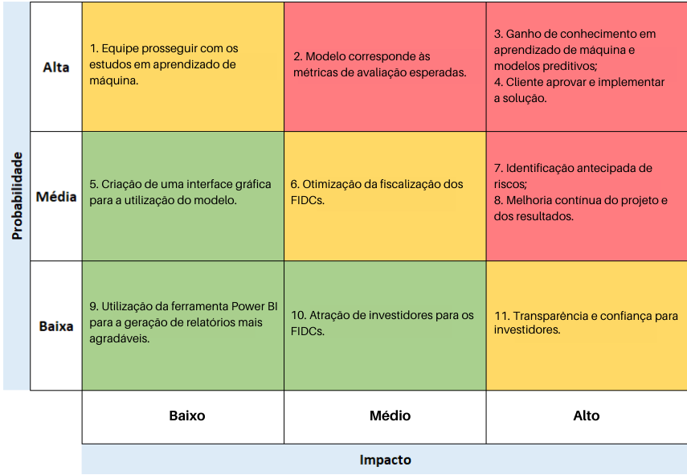
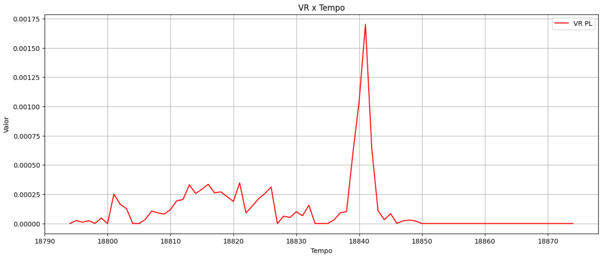

# Documentação Modelo Preditivo - Inteli

## PREDICAS
### FIDCAS

#### Eduardo Barreto, Gabriel Farias, Giovana Katsuki, Isabelle Santos, Lucas Nunes, Victor Marques e Vitto Mazeto

---

## Sumário

- [1. Introdução](#title1)

- [2. Objetivos e Justificativa](#title2)

  - [2.1 Objetivos](#subtitle1)
  - [2.2 Proposta de solução](#subtitle2)
  - [2.3 Jutificativa](#subtitle3)

- [3. Metodologia](#title3)

- [4. Desenvolvimento e Resultados](#title4)
  - [4.1 Compreensão do Problema](#subtitle4)
  - [4.2 Compreensão dos Dados](#subtitle5)
  - [4.3 Preparação dos Dados e Modelagem](#subtitle6)
  - [4.4 Comparação de Modelos](#subtitle7)
  - [4.5 Avaliação](#subtitle8)
  - [4.6 Detalhes da Implementação do *site*](#subtitle9)
- [5. Conclusões e Recomendações](#title5)

- [6. Referências](#title6)

- [Glossário](#glossary)

- [Anexos](#attachments)

---

## 1. Introdução

&nbsp;&nbsp;&nbsp;&nbsp;Ao longo deste documento, é descrito o projeto realizado pelo grupo FIDCAS em parceria com a Comissão de Valores Mobiliários (CVM), autarquia[1](#foot1) brasileira vinculada ao Ministério da Fazenda que possui o objetivo de fiscalizar, normatizar, disciplinar e desenvolver o mercado de valores mobiliários[2](#foot2) do país.

&nbsp;&nbsp;&nbsp;&nbsp;Para fins de contextualização, a CVM surgiu como resposta ao desafio de centralizar as responsabilidades relacionadas à consolidação e ao desenvolvimento de um mercado financeiro sofisticado e de grande porte. Sendo assim, além de seu papel em estimular e assegurar o crescimento e o bom funcionamento do setor, ela também possui, por lei, os poderes normativos e punitivos necessários para cumprir com seus objetivos e regular eficiente e adequadamente o mercado. Logo, constata-se sua importância para o sistema econômico e, consequentemente, para o Estado brasileiro, haja vista sua autoridade singular como entidade administrativa.

&nbsp;&nbsp;&nbsp;&nbsp;No âmbito do projeto, o problema apresentado pela instituição para o grupo de estudantes foi sobre a possibilidade de insuficiência futura ou ausência de provisão para pagamento dos investidores em casos de perda e desvalorização nos fundos de investimento em direitos creditórios (FIDCs)[3](#foot3), impactos negativos geralmente decorrentes da inadimplência dos créditos cedidos. Nas próximas seções deste documento, são detalhados de maneira mais aprofundada o problema, a solução, os objetivos do projeto e suas etapas de desenvolvimento.

---

1 [O que é autarquia?](#gloss1)[↩️](#return1)

2 [O que são valores mobiliários?](#gloss1)[↩️](#return1)

3 [O que são FIDCs?](#gloss1)[↩️](#return2)

---

## 2. Objetivos e Justificativa

&nbsp;&nbsp;&nbsp;&nbsp;Nas subseções seguintes, explanam-se os objetivos gerais e específicos e o propósito do projeto, além do detalhamento da solução tecnológica a ser desenvolvida para a Comissão de Valores Mobiliários e a justificativa para a análise feita e a abordagem escolhida pelo grupo.

### 2.1 Objetivos

&nbsp;&nbsp;&nbsp;&nbsp;A Comissão de Valores Mobiliários desempenha um papel crucial na regulamentação e supervisão do mercado de capitais brasileiro, visando assegurar a transparência, a integridade e a confiança dos investidores. Nesse contexto, o presente projeto tem como objetivo o desenvolvimento de um modelo analítico que permita à Superintendência de Supervisão de Securitização da CVM prever a ocorrência de problemas relacionados à provisão para perdas financeiras nos Fundos de Investimento em Direitos Creditórios.

&nbsp;&nbsp;&nbsp;&nbsp;O propósito é auxiliar a CVM a adotar ações preventivas e corretivas, minimizando os riscos de transferência injusta de riqueza entre cotistas, preservando a estabilidade do mercado e fortalecendo o setor de crédito privado no país, considerando que também será possível oferecer FIDCs para investidores a varejo a partir de outubro de 2023.

Objetivos gerais:

1. Desenvolver um modelo analítico preciso e confiável para prever a ocorrência de problemas relacionados à provisão para perdas nos FIDCs.
2. Contribuir para a atuação proativa da CVM na regulação e supervisão do mercado de FIDCs, visando a estabilidade e confiança dos investidores.

Objetivos específicos:

1. Analisar dados relevantes sobre os FIDCs e seus créditos cedidos, buscando identificar padrões e indicadores que influenciem nas provisões para perdas.
2. Desenvolver algoritmos e técnicas de modelagem preditiva que possam estimar as perdas futuras e auxiliar na constituição adequada de provisões para os FIDCs.
3. Validar o modelo utilizando dados históricos de FIDCs, a fim de avaliar sua eficácia em identificar casos de risco nos Fundos de Investimento de Direitos Creditários.

### 2.2 Proposta de solução
&nbsp;&nbsp;&nbsp;&nbsp;Um grande problema nos fundos de investimento em direitos creditórios está relacionado com eventuais perdas financeiras, sobretudo por conta da inadimplência de créditos cedidos, o que resulta em prejuízo para os investidores e na deterioração da carteira do fundo.

&nbsp;&nbsp;&nbsp;&nbsp;Tendo essa questão em vista, a solução proposta é o desenvolvimento de um modelo analítico preditivo que verifica os dados relevantes dos FIDCs para estimar as chances de aumento do risco e prever problemas relacionados à provisão para perdas financeiras. O modelo utilizará algoritmos e técnicas de modelagem preditiva, ou seja, sistemas de análise de dados e aprendizagem de máquina, para identificar os padrões e indicadores que influenciam nas perdas e, dessa forma, prever possíveis prejuízos futuros e auxiliar na constituição adequada de provisões para os FIDCs.

&nbsp;&nbsp;&nbsp;&nbsp;Sendo assim, o intuito é produzir um modelo de classificação binária, ou seja, uma inteligência artificial que classifique os fundos em duas diferentes categorias. Mais especificamente, no contexto do projeto, as categorias seriam: fundos em risco, pontos de atenção para o usuário final do modelo, e fundos seguros. Ademais, pretende-se também gerar gráficos para visualização dos dados oferecidos como resultado a fim de fornecer uma visualização melhor e mais clara ao usuário.

&nbsp;&nbsp;&nbsp;&nbsp;Com base na análise realizada por essa inteligência artificial, a CVM poderá tomar ações preventivas e corretivas, mitigando riscos para os investidores do mercado e otimizando os processos envolvidos no cumprimento de suas obrigações principais, como a fiscalização e o desenvolvimento do mercado financeiro brasileiro.

### 2.3 Justificativa

&nbsp;&nbsp;&nbsp;&nbsp;Um modelo preditivo é, de forma simplificada, uma função matemática que pode ser aplicada a uma grande quantidade de dados soltos. A ideia é evidenciar padrões capazes de apontar as próximas tendências. Ele se baseia em algoritmos estatísticos e técnicas de *machine learning* para calcular probabilidades de resultados, a partir de dados armazenados em um determinado histórico.

&nbsp;&nbsp;&nbsp;&nbsp;O modelo desenvolvido analisa os informes mensais (IM) com os dados da carteira de créditos do mês, isto é, seu comportamento e características em um determinado mês, evidenciando padrões para realização de predições e de supervisão preventiva no lugar da reativa. Assim, automatizamos uma tarefa que seria extremamente custosa, talvez até impossível de ser feita pela equipe atual da CVM sem o auxílio da tecnologia. Agregamos, pois, um importante valor de inovação e otimização, que acompanha praticidade, desempenho, escalabilidade e, por fim, segurança, já que elimina-se a vulnerabilidade da análise ao erro humano.

&nbsp;&nbsp;&nbsp;&nbsp;Portanto, a solução tecnológica desenvolvida nesse projeto e seus objetivos justificam-se justamente pela necessidade da Comissão de Valores Mobiliários de supervisionar o mercado de maneira mais preventiva e menos reativa, a fim de torná-lo mais seguro para os investidores e, assim, fomentá-lo de forma saudável e segura. Ademais, é válida a menção do fato de que o mercado financeiro brasileiro está em crescimento, tende a continuar dessa forma e possivelmente terá um aumento em sua taxa de crescimento com a nova resolução 175 da CVM, o que gera um aumento na demanda por fiscalização, normatização e apoio, ou seja, uma intensificação do trabalho da CVM. Sendo assim, é preciso que a instituição se modernize, adapte-se e faça uso dos recursos e ferramentas que podem auxiliar nesse processo, como um modelo preditivo com inteligência artificial.

## 3. Metodologia

&nbsp;&nbsp;&nbsp;&nbsp;A metodologia CRISP-DM (Cross-Industry Standard Process for Data Mining) é um modelo de processo de mineração de dados que descreve abordagens comuns usadas por especialistas em mineração de dados para resolver problemas de negócios. Ela é composta por seis fases: entendimento do negócio, entendimento dos dados, preparação dos dados, modelagem, avaliação e implantação. É importante destacar que o CRISP-DM é um processo iterativo, permitindo revisões e refinamentos ao longo do projeto, para garantir a qualidade dos resultados. Vale ressaltar que, a fase de implantação não será abordada, porque o objetivo do projeto é apenas desenvolver um modelo preditivo, não implantá-lo. Nos subtópicos a seguir, são detalhadas as etapas da metodologia CRISP-DM que foram utilizadas para o desenvolvimento do projeto, bem como o referencial teórico que as fundamenta. Um diagrama ilustrativo desses processos é apresentado na imagem abaixo (figura 01).

Figura 01 - Diagrama do Modelo CRISP-DM

Fonte: Escola DNC (2020)

### 3.1 Entendimento do negócio (Business Understanding) 

&nbsp;&nbsp;&nbsp;&nbsp;A primeira fase da metodologia CRISP-DM é o entendimento do negócio, que consiste em uma análise inicial do problema e dos objetivos do projeto, a fim de compreender o contexto e o cenário em que ele está inserido. Nessa etapa, são definidos os objetivos do projeto, seus critérios de sucesso e requisitos a partir de uma análise do problema e do entendimento do negócio da empresa parceira.

### 3.2 Entendimento dos dados (Data Understanding)

&nbsp;&nbsp;&nbsp;&nbsp;O próximo estágio envolve a coleta inicial de dados, a familiarização com os dados, a verificação de sua qualidade e a exploração deles para descobrir insights iniciais. Essa fase é importante para se ter uma noção geral dos dados e do que eles podem oferecer, além de ser fundamental para a próxima etapa, a preparação dos dados. 

### 3.3 Preparação dos dados (Data Preparation)

&nbsp;&nbsp;&nbsp;&nbsp;Sendo a fase mais longa e trabalhosa do projeto, a preparação dos dados inclui todas as atividades necessárias para construir o conjunto de dados final a partir dos dados brutos iniciais, como: seleção de dados corrompidos ou irrelevantes, a construção de novos conjuntos de dados, a transformação de dados para formatos adequados e a integração de dados de diferentes fontes, visando torná-los mais consistentes e adequados para a modelagem. É importante ressaltar que, embora seja a fase mais dispendiosa, ela é fundamental para o sucesso do projeto, pois os dados precisam estar preparados para serem utilizados na modelagem.

### 3.4 Modelagem dos dados (Modeling)

&nbsp;&nbsp;&nbsp;&nbsp;A modelagem é a fase em que os dados são analisados e transformados em modelos preditivos. Nessa etapa, são selecionadas e aplicadas técnicas de modelagem, como algoritmos de aprendizagem de máquina, para construir modelos preditivos. Além disso, é importante ressaltar que, caso os resultados obtidos não sejam satisfatórios, é necessário voltar para a fase de preparação dos dados e refazer o processo.

### 3.5 Avaliação dos resultados (Evaluation)

&nbsp;&nbsp;&nbsp;&nbsp;A avaliação dos resultados é a fase em que os resultados obtidos são avaliados e validados. Nessa etapa, são avaliados os modelos construídos e os resultados obtidos, a fim de verificar se eles atendem aos objetivos do projeto. Caso os resultados não sejam satisfatórios, é necessário voltar para a fase de modelagem e refazer o processo. Esta etapa envolve a utilização de métricas de desempenho e a comparação dos resultados com as metas definidas na etapa de entendimento do negócio.

## 4. Desenvolvimento e Resultados

&nbsp;&nbsp;&nbsp;&nbsp;Nesta seção do documento, são descritas as etapas do desenvolvimento do projeto e os resultados atingidos, desde o entendimento do negócio da CVM e a interpretação inicial do problema e dos nossos objetivos até a avaliação final do modelo preditivo construído. Portanto, observam-se abaixo tópicos como: contextualização e análise do mercado no qual a CVM está inserida e sua respectiva posição dentro dele, planejemaneto da solução desenvolvida e ferramentas ou métodos utilizados (*value proposition canvas*, matriz de riscos; desenvolvimento centrado no usuário, com criação de persona e jornadas de usuário), processo de compreensão e tratamento dos dados, a modelagem e seus resultados.

### 4.1. Compreensão do Problema

&nbsp;&nbsp;&nbsp;&nbsp;A subseção 4.1 trata da análise feita pelo grupo para entender e planejar a solução a ser desenvolvida, abrangindo, assim, a compreensão do mercado e do negócio da empresa parceira, a definição dos riscos, da persona e da visão geral do projeto e, por fim, a política de privacidade associada à solução.

#### 4.1.1. Contexto da indústria

&nbsp;&nbsp;&nbsp;&nbsp;A Comissão de Valores Mobiliários, por ser uma entidade autárquica, vinculada ao governo federal brasileiro e de caráter regulatório, não se encontra inserida em um mercado como *player* (empresa relevante e de participação notória no setor em que está inserida, como a Apple e a Microsoft), mas sim como fiscalizadora, fomentadora e normatizadora do mercado de valores mobiliários.

&nbsp;&nbsp;&nbsp;&nbsp;Esse é, decerto, um dos mais importantes setores da economia brasileira, devido ao intenso fluxo de capital que movimenta e, consequentemente, ao desenvolvimento que proporciona. Ele é imprescindível para a sobrevivência e manutenção do capitalismo e das empresas no país. Logo, a função supervisora exercida pela CVM torna-se, além de muito complexa, fundamental. Afinal, monitorar um mercado inteiro de ações, debêntures, contratos futuros, cotas de fundos de investimento e as operações financeiras envolvidas, garantindo que não ocorram fraudes ou manipulações, não é uma tarefa simples, porém, é extremamente necessária.

&nbsp;&nbsp;&nbsp;&nbsp;Conforme o mercado de valores mobiliários evolui, novas tecnologias surgem como ferramentas para impulsionar seu crescimento, como, por exemplo, os modelos preditivos que avaliam as chances de um fundo de investimentos ter boa rentabilidade futuramente, ou as inteligências artificiais que automatizam negociações de ações na bolsa de valores. A tendência é que essa área seja progressivamente mais repleta de soluções tecnológicas, principalmente com o atual cenário de investimento massivo em IA.

&nbsp;&nbsp;&nbsp;&nbsp;A fim de acompanhar esse crescimento e suprir a maior demanda administrativa, a CVM também está inovando gradativamente em suas formas de cuidado e monitoramento, empregando bastante tecnologia e profissionais especializados para automatizar e otimizar as atividades realizadas. Por isso, a instituição procurou a solução tecnológica criada pelo grupo FIDCAS, um modelo preditivo que determina os fundos de investimento que possuem chances altas de apresentarem um valor de risco elevado no futuro, facilitando e agilizando, assim, a supervisão do mercado.

#### 4.1.2. Análise SWOT 

&nbsp;&nbsp;&nbsp;&nbsp;A análise SWOT avalia a empresa em relação ao mercado de maneira geral. Para isso, são analisados fatores referentes aos ambientes interno e externo do negócio, ou seja, o que está dentro da esfera de controle da empresa e o que não está. Portanto, são avaliadas no ambiente interno “Strengths” (“Forças”; características que trazem um diferencial em relação aos concorrentes e podem influenciar positivamente) e “Weaknesses” (“Fraquezas”; elementos que, por não serem pontos fortes da empresa, fornecem algum tipo de vantagem aos competidores e podem influenciar negativamente), enquanto no ambiente externo são analisadas “Opportunities” (“Oportunidades”; dizem respeito a possibilidades de obter melhores resultados, maior lucratividade ou crescer por causa de conjunturas externas favoráveis) e “Threats” (“Ameaças”; referem-se aos cenários externos desfavoráveis que colocam em risco o desenvolvimento ou a permanência da empresa no mercado).

&nbsp;&nbsp;&nbsp;&nbsp;A seguir, na figura 02, demonstra-se a matriz SWOT construída pelo grupo FIDCAS em relação à CVM, autarquia que, apesar de não ser um *player* de mercado e realizar, na verdade, função fiscalizadora, normatizadora e fomentadora, apresenta características passíveis à análise nesse modelo de forças, fraquezas, oportunidades e ameaças.

Figura 02 - Matriz SWOT

Fonte: Material produzido pelos autores (2023)

&nbsp;&nbsp;&nbsp;&nbsp;Na sequência, são justificados e detalhados os pontos supracitados na imagem, a fim de explanar a análise feita pelo grupo acerca da CVM.

#### Forças

&nbsp;&nbsp;&nbsp;&nbsp;Autarquia com autoridade administrativa e legal: a Comissão de Valores Mobiliários não está sujeita a subordinação hierárquica e é dotada de autoridade administrativa independente. Além disso, ela atua como fiscalizadora e normatizadora do mercado financeiro, possuindo poder suficiente para a concepção de leis e punição de infratores. Logo, a CVM é uma importante e respeitada autoridade no mercado. 

&nbsp;&nbsp;&nbsp;&nbsp;Reputação e credibilidade: a eficácia, a eficiência e o valor da atuação da CVM na fiscalização, normatização e desenvolvimento do mercado financeiro brasileiro se provaram muito positivos ao longo do seu tempo de atividade. Por conseguinte, a instituição adquiriu boa reputação, credibilidade, confiabilidade e respeito entre as entidades participantes do mercado. 

&nbsp;&nbsp;&nbsp;&nbsp;Inovação tecnológica: com a modernização das tecnologias utilizadas pela CVM ao longo dos anos e a busca da instituição por inovação, corroborada pela parceria com o Instituto de Tecnologia e Liderança para desenvolvimento de um projeto de modelo preditivo, nota-se o processo interno de evolução tecnológica para potencialização da eficiência de trabalho da autarquia. 

&nbsp;&nbsp;&nbsp;&nbsp;Profissionais especializados: como explicitado no **site** da CVM, os profissionais que trabalham para a instituição são escolhidos de acordo com diversos fatores, como capacidade e especialização técnica, formação acadêmica e competência para exercer o cargo. Ademais, é preciso, para boa parte dos cargos, ser aprovado em um concurso público próprio da Comissão de Valores Mobiliários para ser contratado.

&nbsp;&nbsp;&nbsp;&nbsp;Participação ativa para desenvolvimento do mercado: a Comissão de Valores Mobiliários tem como uma de suas principais premissas agir em prol do desenvolvimento do mercado de investimentos. A fim de atingir esse objetivo, a instituição atua na criação, no financiamento e no apoio a cursos de formação de novos investidores e ações ligadas à expansão da educação financeira no Brasil, como os cursos que disponibilizou para as escolas do país em parceria com o Sebrae e o Ministério da Educação (Governo Federal Brasileiro, 2023). 

&nbsp;&nbsp;&nbsp;&nbsp;Colaboração internacional: a CVM está presente nos principais organismos e fóruns internacionais ligados ao mercado de capitais, devido ao aumento das transações envolvendo mais de uma jurisdição, à crescente sofisticação de produtos e ao crescimento da inserção e da relevância do Brasil no cenário mundial. Por isso, a autarquia firmou acordos internacionais de cooperação técnica, troca de informações e relacionamentos multi e bilaterais (Governo Federal Brasileiro, 2023). 

#### Fraquezas

&nbsp;&nbsp;&nbsp;&nbsp;Recrutamentos em períodos muito espaçados: os concursos públicos para contratação da CVM ocorrem irregularmente e entre espaços de tempo muito longos; o último ocorreu em 2010, por exemplo. Isso gera uma carência na renovação de funcionários, ou seja, enquanto uma parte dos colaboradores se aposenta ou deixa de trabalhar na instituição, não há entrada de novos profissionais para suprir as demandas do mercado, que só tendem a crescer.

&nbsp;&nbsp;&nbsp;&nbsp;Déficit nas equipes de colaboradores: na entrevista com a autarquia parceira do projeto, realizada no dia quatro de agosto de 2023, o superintendente Bruno de Freitas Gomes, da Superintendência de Securitização e Agronegócio, citou que a CVM atualmente enfrenta problemas com a falta de funcionários. Segundo ele, as equipes se tornaram escassas nos últimos anos, devido principalmente ao grande número de aposentadorias e à pandemia do vírus COVID-19, e como mencionado no tópico anterior, há uma defasagem nas contratações da CVM, o que impossibilitou a rotatividade de pessoas nos times da instituição.

&nbsp;&nbsp;&nbsp;&nbsp;Monitoramento de informações privilegiadas: o fornecimento de informações privilegiadas acerca do mercado financeiro é um problema grave e muito complexo de lidar. Com os recursos dos quais a CVM dispõe, torna-se difícil monitorar esse compartilhamento ilegal de informações e provar a ocorrência dessa infração à lei, o que representa um risco para o objetivo de fiscalização e cuidado do mercado pela autarquia. Historicamente, fraquezas da CVM que impactam diretamente no cumprimento de suas obrigações geraram consequências catastróficas, a exemplo do escândalo na bolsa de valores do Rio de Janeiro ocasionado pelo empresário Naji Nahas em 1989 (Campos, 2020). Entretanto, é válido mencionar que esse monitoramento é fundamentalmente muito delicado e desafiador, pois é demasiadamente complicado identificar uma possível ocorrência de comunicação suspeita e, sobretudo, confirmar ou não a hipótese, haja vista o número de diferentes canais pelos quais as informações podem trafegar e a possibilidade do anonimato digital. 

&nbsp;&nbsp;&nbsp;&nbsp;Supervisão reativa e não preventiva: embora o avanço exponencial da tecnologia seja realidade hodiernamente e a CVM esteja buscando inovar em seu arcabouço tecnológico, como mencionado anteriormente nas forças da instituição, ainda é difícil prever a ocorrência de fraudes, irregularidades, ilegalidades e perdas financeiras graves, processos que prejudicam a saúde e o desenvolvimento do mercado financeiro, como a quebra do fundo Pátria (Cardoso, 2023), investimento que se manteve consideravelmente lucrativo durante um período de tempo e depois gerou dívidas pesadas aos cotistas.

#### Oportunidades

&nbsp;&nbsp;&nbsp;&nbsp;Abertura a varejo: observando a ampliação das possibilidades de investimentos para o público varejista sob uma ótica otimista, o mercado financeiro tende a expandir e, consequentemente, desenvolver-se também, o que vai ao encontro das premissas essenciais da Comissão de Valores Mobiliários. No entanto, a autarquia terá que dobrar esforços para continuar desempenhando suas funções reguladoras conforme o mercado cresce e diversos novos investidores ingressam. Assim, a abertura a varejo poderia ser classificada também como um risco. Porém, considerando a reputação e o histórico de atuação da CVM, optou-se por avaliá-la como uma oportunidade.  

&nbsp;&nbsp;&nbsp;&nbsp;Investimento no mercado de Fiagros, sustentabilidade, futebol e criptoeconomia: João Pedro Nascimento, presidente da Comissão de Valores Mobiliários, revelou em evento no dia três de agosto de 2023 o interesse pelo investimento no mercado de Fiagros (fundos que investem nas cadeias produtivas agroindustriais), de investimentos direcionados a atividades econômicas sustentáveis, da agenda ESG[4](#foot4) (ambiental, social e governança, traduzido do inglês "environment, social and governance"), da economia verde[5](#foot5), de capitais nos clubes de futebol e de criptomoedas (valores de troca digitais que permitem transações a nível mundial de forma quase instantânea), com o objetivo de aumentar significativamente o número de pessoas físicas como investidoras no mercado, desenvolver o setor e atrair capital para o país (Rivas, 2023). Como o tópico anterior, esse também poderia ser considerado uma ameaça em vez de uma oportunidade. Todavia, os índices atuais de crescimento dos setores mencionados apontam para um provável sucesso.

&nbsp;&nbsp;&nbsp;&nbsp;Novas regras da resolução 175 da CVM: a resolução 175 da Comissão de Valores Mobiliários entrará em vigência em outubro de 2023 e apresenta um regulamento favorável para a evolução do mercado financeiro brasileiro, como a abertura de alguns tipos de fundos de investimento ao público varejista e a mudança no sistema de responsabilização dos cotistas dos fundos. Essa última refere-se à atual possibilidade de endividamento grave dos cotistas, que passarão a ser responsabilizados apenas pelo valor que aplicaram no investimento a partir de outubro, estimulando alocações mais agressivas em ativos de risco mais elevado, área pouco explorada no setor financeiro do Brasil.

&nbsp;&nbsp;&nbsp;&nbsp;Formação de novos investidores: devido ao vasto número atual de cursos sobre educação financeira e mercado de investimentos, incluindo os disponibilizados pela própria CVM, a tendência é que a quantidade de investidores aumente gradativamente, colaborando para o crescimento e desenvolvimento do mercado financeiro brasileiro.  

#### Ameaças

&nbsp;&nbsp;&nbsp;&nbsp;Incapacidade de atendimento de novas demandas: há, coforme as informações presentes nos tópicos supracitados, a tendência de crescimento do mercado financeiro brasileiro, tanto no âmbito dos investidores quanto das possibilidades de investimentos. Esse aumento de demanda pode acarretar em desafios para a fiscalização efetiva e eficiente da CVM, principalmente ao considerar-se a fraqueza mencionada relativa ao déficit nas equipes da autarquia.  

&nbsp;&nbsp;&nbsp;&nbsp;Disseminação de informação privilegiada: o vazamento ilegal de informações privilegiadas sempre foi uma ameaça para a Comissão de Valores Imobiliários e, historicamente, causou problemas graves no mercado financeiro. Com o esperado aumento futuro desse mercado, esse risco se torna maior e mais complicado de ser administrado.

&nbsp;&nbsp;&nbsp;&nbsp;Prejuízo reputacional: devido a importância, criticidade e complexidade do trabalho realizado pela Comissão de Valores Mobiliários, a autarquia está constantemente sob pressão, pois está sujeita ao risco de perder credibilidade e ferir sua reputação caso cometa algum erro em suas tarefas de fiscalização, supervisão, normatização e fomento do mercado.

&nbsp;&nbsp;&nbsp;&nbsp;Omissão de dados: os processos de fiscalização e supervisão da CVM dependem da transparência dos fundos de investimento e dos investidores no que tange seus dados. Entretanto, há a possibilidades desses serem omitidos, apesar das punições graves que podem ser aplicadas, prejudicando o desempenho da autarquia na realização de suas obrigações. 

&nbsp;&nbsp;&nbsp;&nbsp;Crise econômica: como a Comissão de Valores Mobiliários está intrinsecamente ligada ao mercado financeiro do Brasil, ela também está sujeita às consequências de uma crise econômica no país. Portanto, os potenciais efeitos destruidores de uma crise sobre o mercado podem desestabilizar a estrutura organizacional da CVM e impossibilitar sua atuação eficiente.

---

4 [O que é agenda ESG?](#gloss2)[↩️](#return3)

5 [O que é economia verde?](#gloss2)[↩️](#return3)

---

#### 4.1.3. 5 forças de Porter

&nbsp;&nbsp;&nbsp;&nbsp;A análise das 5 Forças de Porter permite mapear o mercado para fortalecer o planejamento e a tomada de decisão de uma empresa para entrar no mercado, realizar um projeto estrategicamente ou avaliar suas condições atuais em relação ao setor como um todo. Ela é baseada em fatos e análises sistemáticas do mercado, com ênfase nos fatores referentes à competitividade. Todas as 5 Forças de Porter são capazes de afetar a lucratividade de um negócio de acordo com o nível de poder que possuem no setor. Elas são: Concorrentes, Fornecedores, Clientes, Novos Entrantes e Substitutos. Tratando-se de uma autarquia federal, essa análise terá algumas diferenças ao se comparar como uma empresa privada tradicional, tópico que é explorado na sequência. Abaixo, ilustra-se esse processo analítico na figura 03.

Figura 03 - 5 forças de Porter CVM

Fonte: Material produzido pelos autores (2023)

##### Rivalidade entre concorrentes

&nbsp;&nbsp;&nbsp;&nbsp;Tratando-se de uma autarquia federal, a CVM ocupa uma posição única no sistema regulatório brasileiro, não possuindo concorrentes. Responsável por regular e supervisionar o mercado de valores mobiliários no Brasil, a CVM tem um mandato legal para desempenhar funções que não podem ser replicadas. Essa exclusividade garante que a CVM não enfrente competição ou rivalidade de outras instituições no cumprimento de suas responsabilidades

##### Poder de barganha dos fornecedores

&nbsp;&nbsp;&nbsp;&nbsp;A CVM pode possuir diversos fornecedores, como serviços jurídicos e de tecnologia, por exemplo, no entanto, seu papel regulatório confere um grau significativo de controle sobre as interações com os fornecedores. Além disso, sendo uma entidade pública, a seleção e contratação de serviços e fornecedores deve seguir os processos de licitação, conforme estabelecido pela legislação brasileira. Esse processo garante transparência e concorrência justa, limitando ainda mais o poder de barganha dos fornecedores. Portanto, embora a CVM possa depender de fornecedores externos para alguns serviços, o poder de barganha destes sobre a instituição é mínimo.

##### Poder de barganha dos compradores

&nbsp;&nbsp;&nbsp;&nbsp;Considerando a CVM um órgão regulador, não existem compradores no sentido tradicional. A principal função da instituição não é vender produtos ou serviços, mas sim proteger os investidores e garantir o funcionamento adequado do mercado de valores mobiliários do Brasil. Dessa forma, concluímos que o poder de barganha dos compradores pode ser considerado inexistente, visto que se trata de uma autarquia federal e a lei se sobrepõe aos interesses individuais.

##### Ameaça de novos entrantes

&nbsp;&nbsp;&nbsp;&nbsp;Dado o caráter regulatório da CVM, a ameaça de novos entrantes não se aplica ao contexto. A entidade possui um mandato legal exclusivo para regular o mercado de valores mobiliários segundo a lei No 6.385, de 7 de dezembro de 1976. Essa exclusividade do mandato, concedida e protegida pelo governo, assegura que a CVM não possua concorrência ou ameaça de novos entrantes que poderiam desafiar a sua posição.

##### Ameaça de produtos ou serviços substitutos

&nbsp;&nbsp;&nbsp;&nbsp;A ameaça de serviços substitutos no contexto da CVM é inexistente, uma vez que a CVM possui um mandato legal e exclusivo garantido por lei. Como órgão responsável pela regulação do mercado de valores mobiliários o Brasil, a CVM possui um mandato legal que não permite que os seus serviços sejam replicados por outras entidades. Essa exclusividade legal elimina qualquer ameaça e reforça o papel vital da CVM na manutenção do mercado de valores mobiliários brasileiro.

#### 4.1.4. Planejamento Geral da Solução

&nbsp;&nbsp;&nbsp;&nbsp;A fim de solucionar a problemática apresentada pela Comissão de Valores Mobiliários, ou seja, a possibilidade de insuficiência futura ou ausência de provisão para pagamento dos investidores em casos de perda e desvalorização nos FIDCs, planeja-se desenvolver um modelo preditivo utilizando inteligência artificial e técnicas de *machine learning* para determinar se um fundo de investimento em direitos creditórios está em risco de perda futura. Assim, pretende-se construir uma ferramenta para auxiliar os Analistas da Superintendência de Securitização da CVM, usuários finais do produto resultante deste projeto, na supervisão dos FIDCs, gerando um ganho significativo de eficiência, otimização de processos e automatização de tarefas. Por conseguinte, impacta-se na saúde, estabilidade, segurança e crescimento do mercado financeiro brasileiro.

&nbsp;&nbsp;&nbsp;&nbsp;Tendo esse objetivo de desenvolvimento do modelo em vista, é necessário definir o conjunto de dados que serão usados para realização da aprendizagem de máquina e construção da solução. Dessa forma, a CVM disponibilizou tabelas contendo informações diversas sobre cerca de dois mil FIDCs em forma de informes mensais, que dizem respeito às características jurídicas e financeiras, aos recebíveis, à provisão e à inadimplência de cada fundo. Tais informes mensais apresentam vários atributos do fundo, desde administração até dados financeiros, como ativos, passivos, patrimônio líquido, entre outros. Além disso, o conjunto fornecido representa aproximadamente 57 mil registros, colaborando para uma boa parcela de treino e teste do modelo e, acima de tudo, para o aprendizado acerca do padrão dos dados.

&nbsp;&nbsp;&nbsp;&nbsp;Consumindo esses dados, o grupo FIDCAS intenciona arquitetar uma tecnologia de classificação, isto é, um modelo preditivo que classifique os FIDCs de acordo com a análise da relação entre aumento do valor de risco (valor presente nas tabelas criado pela CVM para monitoramento dos fundos) e outros dados dos informes em duas diferentes classes: fundos em risco e fundos seguros.

&nbsp;&nbsp;&nbsp;&nbsp;Por fim, vide o intuito de aplicação da solução como ferramenta de supervisão de FIDCs e a criticidade da tarefa que ela executa, estabeleceu-se a meta de noventa e cinco porcento de acurácia mínima como alvo do projeto, critério que determinará o sucesso ou falha do modelo desenvolvido. Ademais, considerando o alto custo de falsos negativos quando comparados com falsos positivos, pretende-se chegar a uma métrica de valor semelhante (noventa e cinco porcento) no tocante ao *recall* (métrica utilizada para avaliar a capacidade do modelo em prever corretamente verdadeiros positivos, minimizando a ocorrência de falsos negativos).

#### 4.1.5. Value Proposition Canvas

&nbsp;&nbsp;&nbsp;&nbsp;O *Value Proposition Canvas* (Canvas da Proposta de Valor) é uma ferramenta utilizada para ajudar empresas, organizações e até mesmo projetos a criar uma proposta de valor convincente para seus clientes ou usuários finais. Consiste em um modelo visual que permite a identificação dos elementos fundamentais que compõem a proposta de valor, tais como os benefícios oferecidos ao cliente, as dores e necessidades do cliente, as soluções oferecidas, dentre outros fatores. Por essa razão, para melhor apresentar a proposta de valor deste projeto, foi desenvolvido o canvas da proposta de valor da solução desenvolvida, o qual está evidenciado na figura a seguir (figura 04).

Figura 04 - Canvas da Proposta de Valor do Projeto

Fonte: Material produzido pelos autores (2023)

&nbsp;&nbsp;&nbsp;&nbsp;Nesse viés, as tarefas dos usuários - nesse caso foram considerados os analistas da Superintendência de Supervisão de Securitização (SSE) - foram listadas como: analisar o IM, que diz respeito à leitura e ao entendimento do Informe Mensal, monitorar e fiscalizar a conformidade dos FIDCs, identificar riscos e gerar relatórios. Tais tarefas elucidam o que os usuários realizam no cotidiano do seu trabalho.

&nbsp;&nbsp;&nbsp;&nbsp;Ademais, as dores dos usuários surgem a partir da realização das tarefas e, neste projeto, foram encontradas as seguintes dores (com base na documentação enviada pela CVM): grande volume de dados dos FIDCs - 10 tabelas -, cálculo manual do valor de risco do fundo, análise de tendências requer muito tempo e a existência de mais de 2 mil fundos. Sob essa ótica, essas dores são algumas das justificativas para a realização do projeto.

&nbsp;&nbsp;&nbsp;&nbsp;Outrossim, os ganhos que o usuário espera também foram informados no canvas supramencionado, os quais são: minimizar o risco de transferência de riqueza entre cotistas, otimizar o monitoramento de riscos, prever o risco de inadimplência de um FIDC. Esses ganhos são esperados pela CVM com a entrega deste projeto.

&nbsp;&nbsp;&nbsp;&nbsp;Além disso, no lado esquerdo do canvas há a parte relacionada à solução, de modo que os criadores de ganhos (como a solução gera os ganhos para o usuário), os aliviadores das dores dos usuários e os produtos/serviços oferecidos. Tais pontos estão detalhados nos parágrafos abaixo.

&nbsp;&nbsp;&nbsp;&nbsp;Dessa forma, foi pensado no alívio das dores com base nos seguintes pontos: previsão dos fundos que precisam de monitoramento mais detalhado, modelo treinado com grande parte das ocorrências passadas e cálculo automático do Valor de Risco. Com esses três princípios, o projeto visa amenizar ou colaborar para o alívio das dores citadas acima.

&nbsp;&nbsp;&nbsp;&nbsp;Além do mais, os criadores de ganho demonstram como a solução promove ganhos (esperados ou não) pelos clientes. Sendo assim, os criadores de ganho desta solução são: classificação dos fundos em termos de alto risco ou baixo risco, treinamento com uma grande base de dados e features selecionadas e atenção maior aos fundos com alto risco - relatório objetivo.

&nbsp;&nbsp;&nbsp;&nbsp;Por fim, o produto criado é, conforme citado ao decorrer deste trabalho, um modelo de *Machine Learning* capaz de prever riscos de inadimplência em um FIDC, alicerçado em classificações e variáveis disponibilizadas da base de dados dos fundos supervisionados pela CVM.

#### 4.1.6. Matriz de Riscos
&nbsp;&nbsp;&nbsp;&nbsp;A priori, a matriz de risco visa identificar os principais riscos para este projeto, bem como os impactos desses riscos, de modo que tal ferramenta colabora com a prevenção e, em casos mais extremos, com o plano de ação para as ameaças encontradas. Outrossim, tal matriz também pode representar as oportunidades para o projeto, classificando-as por ordem de impacto e probabilidade, assim como os riscos são classificados.

&nbsp;&nbsp;&nbsp;&nbsp;Nesse sentido, para construir uma matriz de riscos é necessário listar todas as possíveis ameaças para o projeto, sem considerar, inicialmente, quais são os impactos e as probabilidades de ocorrência de cada um. Logo, os seguintes riscos foram elencados para este projeto:

1. Alto custo de implementação e manutenção do modelo;
2. Falta de expertise no ramo de atuação do modelo resultar em um modelo com uma precisão menor;
3. Seleção inadequada de variáveis.
4. A solução não apresenta boa escalabilidade para grandes dados;
5. *Overfitting* — o modelo tem um bom desempenho no treinamento, no entanto, não tem o mesmo desempenho para novos dados;
6.  O modelo preditivo não possui métricas de avaliação aceitáveis — valores muito baixos;
7. O modelo possui um alto número de falsos negativos;
8. Mudanças econômicas que afetem a eficácia do modelo;
9. *Underfitting* — o modelo não captura a complexidade dos dados e, por conseguinte, não realiza boas previsões;
10. Dificuldade em explicar a solução implementada, incluindo seus resultados;
11. Dados ausentes ou incompletos que podem prejudicar a precisão do modelo;
12. Solução enviesada, de modo que as decisões não sejam justas;

&nbsp;&nbsp;&nbsp;&nbsp;Dessa forma, com base nessa listagem dos riscos para o projeto de criação do modelo preditivo, é possível estruturar a matriz de risco e o respectivo plano de ação para cada risco. Nesse viés, a figura abaixo (figura 05) ilustra tal ferramenta.

Figura 05 - Matriz de riscos do projeto

Fonte: Material produzido pelos autores (2023)

&nbsp;&nbsp;&nbsp;&nbsp;Por conseguinte, os riscos supracitados foram dispostos na matriz considerando a probabilidade de ocorrência, análise vertical, e o impacto caso ocorra, análise horizontal. Nos tópicos a seguir há a justificativa para a classificação (posição na tabela para cada risco).

* **Alto custo de implementação e manutenção do modelo** —  soluções de Inteligência Artificial têm um alto custo financeiro, devido aos requisitos computacionais, e, como este projeto trata-se de um modelo de *machine learning*, há uma alta probabilidade do risco se concretizar. Do ponto de vista do impacto, considera-se baixo porque, caso ocorra, há um plano de ação bem definido e, acima de tudo, a preocupação excessiva com o custo do projeto não convém aos desenvolvedores da solução.
* **Falta de expertise no ramo de atuação do modelo resultar em um modelo com uma precisão menor** — considerando que o projeto abrange o terceiro módulo da graduação e contempla um tema complexo - área de atuação da CVM - é notório que há uma probabilidade consideravelmente alta dessa falta de expertise afete na eficácia do modelo. Por sua vez, esse risco apresenta um impacto médio, já que diversos testes serão realizados e na percepção de que a precisão está comprometida, outros modelos e variáveis serão testados rapidamente.
* **Seleção inadequada de variáveis** — há uma alta probabilidade de que variáveis inadequadas sejam selecionadas, pois os desenvolvedores não entendem completamente o mercado financeiro. Embora haja um plano de ação, o impacto é alto porque uma seleção inadequada de variáveis pode afetar diretamente no viés do modelo e torná-lo sensível a pequenas alterações.
* **A solução não apresenta boa escalabilidade para grandes dados** — a probabilidade desse risco ocorrer foi tida como média porque o ambiente de desenvolvimento do projeto (Google Colaboratory ou Jupyter local) é limitado e dificilmente comporta dados de períodos longos. O impacto é baixo, pois o limite desses ambientes é suficiente para desenvolver um modelo preciso e eficaz.
* ***Overfitting* — o modelo tem um bom desempenho no treinamento, no entanto, não tem o mesmo desempenho para novos dados** — a probabilidade média decorre do fato de que esse é um problema recorrente na construção de modelos preditivos, especialmente quando há inúmeras variáveis ou quando o modelo é complexo. O impacto médio é justificado, pois, se o *Overfitting* ocorrer, o modelo pode ter um desempenho excelente nos dados de treinamento, mas falhar em fazer previsões precisas e confiáveis em novos cenários.
* **O modelo preditivo não possui métricas de avaliação aceitáveis** — em projetos de modelagem preditiva, é comum que os desenvolvedores se deparem com desafios ao ajustar o modelo para obter métricas de avaliação satisfatórias. O impacto alto é justificado pela gravidade das consequências caso o modelo não possua métricas de avaliação aceitáveis.
* **O modelo possui um alto número de falsos negativos** —  a probabilidade média provém do fato da complexidade do problema em questão e pela possibilidade de ajustar o modelo para minimizar os falsos negativos (o que faz com que não seja alta). O impacto alto é justificado pelas consequências sérias de um alto número de falsos negativos, citadas pela CVM, relacionadas, sobretudo, ao custo elevado de um falso negativo.
* **Mudanças econômicas que afetem a eficácia do modelo** — mudanças econômicas significativas não ocorrem com frequência, justificando a probabilidade baixa. O impacto baixo é justificado pelo fato de que, embora mudanças econômicas afetem o desempenho do modelo, a probabilidade de causar danos graves ou permanentes é baixa.
* ***Underfitting* — o modelo não captura a complexidade dos dados e, por conseguinte, não realiza boas previsões** — a probabilidade baixa desse risco ocorrer é justificada pelo fato de que a equipe, ao desenvolver o modelo, estará ciente da importância de criar uma estrutura adequada e abrangente que capture a complexidade dos dados. O impacto médio é justificado pelo fato de que, se o *Underfitting* ocorrer, o modelo não conseguirá realizar previsões precisas.
* **Dificuldade em explicar a solução implementada, incluindo seus resultados** — a probabilidade baixa desse risco ocorrer é justificada pelo fato de que os desenvolvedores estarão cientes da importância de documentar e comunicar adequadamente a solução implementada. O impacto médio é justificado pelo fato de que, se a solução não for bem explicada, isso pode levar a mal-entendidos e falta de confiança dos *stakeholders*.
* **Dados ausentes ou incompletos que podem prejudicar a precisão do modelo** — a CMV disponibilizou uma quantidade considerável de dados, tornando a probabilidade desse risco baixa. Em contrapartida, caso ocorra, o projeto será altamente impactado, já que dados ausentes ou incompletos podem levar a erros significativos nas previsões, comprometendo a eficácia do modelo.
* **Solução enviesada, de modo que as decisões não sejam justas** — a equipe, orientada pela experiência do usuário, busca não enviesar o modelo, tornando a probabilidade desse risco ocorrer ser baixa. Todavia, o impacto é alto pelo fato de que a presença de viés na solução pode levar a decisões injustas e discriminatórias, afetando negativamente os investidores, empresas ou instituições envolvidas e a reputação do modelo preditivo.

&nbsp;&nbsp;&nbsp;&nbsp;Por fim, após listar os riscos e classificá-los consoante a probabilidade e o impacto, resta descrever o plano de ação para cada risco, isto é, como a equipe vai se comportar caso algum desses erros ocorra durante o desenvolvimento do projeto. Sedo assim, os planos de ação estão detalhados nos tópicos abaixo.

* Risco 1 - Otimizar os recursos de *hardware* e *software*, utilizando abordagens mais eficientes, reduzindo o tempo de processamento e diminuindo os custos operacionais; Avaliar outras opções de modelos ou abordagens que possam atender aos requisitos do projeto de forma mais econômica, sem comprometer a qualidade ou eficácia do modelo.
* Risco 2 - Investir tempo na compreensão detalhada do ramo de atuação da CVM e das particularidades dos Fundos de Investimento em Direitos Creditórios.
* Risco 3 - Consultar especialistas do setor da CMV nas entrevistas/apresentações de final de sprint durante o processo de seleção de variáveis e modelagem para garantir a inclusão das características mais relevantes e compreender melhor as complexidades do domínio.
* Risco 4 - Utilizar técnicas de amostragem para trabalhar com subconjuntos representativos dos dados, permitindo que o modelo seja desenvolvido e testado em um ambiente mais gerenciável; Buscar maneiras de otimizar os recursos disponíveis nos ambientes de desenvolvimento, como o uso eficiente de memória e a paralelização de tarefas, para melhorar o desempenho com grandes conjuntos de dados.
* Risco 5 - Separar um conjunto de dados de validação para avaliar o desempenho do modelo durante o treinamento, permitindo identificar sinais de *Overfitting*.
* Risco 6 - Utilizar um conjunto de dados de validação bem representativo para avaliar o desempenho do modelo em dados não utilizados no treinamento, garantindo uma avaliação mais realista;  Realizar ajustes cuidadosos nos hiperparâmetros[6](#foot6) do modelo para encontrar a melhor configuração que resulte em métricas de avaliação mais satisfatórias.
* Risco 7 - Priorizar métricas como *recall* (taxa de verdadeiros positivos) para avaliar o desempenho do modelo em relação aos falsos negativos e garantir que ele esteja minimizando essa ocorrência; Realizar ajustes nos limiares de decisão do modelo para equilibrar a taxa de falsos negativos e falsos positivos, dependendo das necessidades específicas do projeto e dos objetivos de gestão de riscos financeiros.
* Risco 8 - Garantir que o modelo seja alimentado com dados atualizados para refletir as mudanças no mercado financeiro e melhorar a precisão das previsões.
* Risco 9 - Garantir que o conjunto de variáveis selecionadas seja relevante e abrangente, permitindo que o modelo compreenda a complexidade dos dados; Realizar ajustes nos hiperparâmetros do modelo durante o processo de treinamento para encontrar a melhor configuração que minimize o *Underfitting*.
* Risco 10 - Elaborar documentações claras e abrangentes que descrevam a metodologia adotada, os processos de desenvolvimento, a seleção de variáveis, a arquitetura do modelo e a interpretação dos resultados é essencial para garantir a transparência e a confiabilidade de qualquer projeto de *machine learning*. Além disso, é importante utilizar técnicas de explicabilidade, como LIME (*Local Interpretable Model-agnostic Explanations*) e SHAP (*SHapley Additive exPlanations*), para obter *insights* sobre como o modelo toma decisões e identificar quais variáveis são mais relevantes para suas previsões.
* Risco 11 - Realizar uma etapa de pré-processamento robusta para identificar e lidar com dados ausentes ou incompletos antes do treinamento do modelo; Utilizar técnicas de imputação, como preenchimento por média, mediana ou regressão, para preencher valores faltantes adequadamente.
* Risco 12 - Garantir que as variáveis utilizadas no modelo sejam relevantes para a tomada de decisões financeiras e que não introduzam viés nos resultados; Incorporar princípios éticos no desenvolvimento do modelo, assegurando que as previsões sejam justas e imparciais para todos os envolvidos.

##### 4.1.6.1 Matriz de Oportunidades

&nbsp;&nbsp;&nbsp;&nbsp;Em paralelo à matriz de riscos, a matriz de oportunidades é uma ferramenta que visa identificar as principais oportunidades que podem impactar positivamente o projeto. Ela permite avaliar os potenciais benefícios que podem ser aproveitados, colaborando assim para a maximização dos resultados e o aprimoramento do planejamento. Assim como a matriz de riscos, essa ferramenta classifica as oportunidades por ordem de impacto e probabilidade, permitindo uma abordagem estruturada dessas.

&nbsp;&nbsp;&nbsp;&nbsp;Tal como na matriz de riscos, para construir uma matriz de oportunidades, é necessário listar todas as possíveis oportunidades relevantes para o projeto, sem considerar inicialmente os impactos e as probabilidades de ocorrência de cada uma. Nos tópicos abaixo, estão listadas algumas oportunidades identificadas para este projeto:

1. Equipe prosseguir com os estudos em aprendizado de máquina;
2. Modelo corresponde às métricas de avaliação esperadas;
3. Ganho de conhecimento em aprendizado de máquina e modelos preditivos;
4. Cliente aprovar e implementar a solução;
5. Criação de uma interface gráfica para a utilização do modelo;
6. Otimização da fiscalização dos FIDCs;
7. Identificação antecipada de riscos;
8. Melhoria contínua do projeto e dos resultados;
9. Utilização da ferramenta *Power BI* para a geração de relatórios mais agradáveis;
10. Atração de investidores para os FIDCs;
11. Transparência e confiança para investidores.

&nbsp;&nbsp;&nbsp;&nbsp;Sob essa perspectiva, é possível estruturar a matriz de oportunidade para cada um dos itens acima. Posto isso, a figura abaixo (figura 06) ilustra as oportunidades classificadas consoante o impacto e a probabilidade de ocorrência de cada uma.

Figura 06 - Matriz de oportunidades do projeto

Fonte: Material produzido pelos autores (2023)

&nbsp;&nbsp;&nbsp;&nbsp;Dessa maneira, bem como na matriz de riscos, as probabilidades estão dispostas considerando a probabilidade de ocorrência (horizontal) e o impacto (vertical). Logo, a seguir a justificativa para cada classificação (posição) da matriz supracitada.

* **Equipe prosseguir com os estudos em aprendizado de máquina** - os desenvolvedores do projeto pretendem e, a depender do período, da graduação, precisam desenvolver seus conhecimentos em IA e Machine Learning, o que faz com que a probabilidade dessa oportunidade seja alta. O impacto é baixo, pois o prosseguimento dos estudos no tema, após a finalização do projeto, não impacta na criação do modelo nem agrega um alto valor para o projeto atual.
* **Modelo corresponde às métricas de avaliação esperadas** - os desenvolvedores do projeto visam entregar um modelo que tenha um bom desempenho e que se adeque bem aos dados dos fundos, o que faz com que a probabilidade dessa oportunidade seja alta. O impacto, por sua vez, é médio, já que o alinhamento do modelo às métricas de avaliação esperadas é essencial para a eficácia e a confiabilidade das previsões.
* **Ganho de conhecimento em aprendizado de máquina e modelos preditivos** - o impacto e a probabilidade são altos, pois esse é justamente o objetivo do módulo III do Inteli: ensinar os alunos acerca do aprendizado de máquina baseado em um projeto de criação de um modelo preditivo.
* **Cliente aprovar e implementar a solução** - tanto o impacto quanto a probabilidade são altos porque a aprovação do cliente é crucial para a equipe entender se o que fez é realmente útil e, acima de tudo, se atende às expectativas do cliente.
* **Criação de uma interface gráfica para a utilização do modelo** - por se tratar de uma responsabilidade da CVM e não ser o foco desse projeto, o impacto é baixo, caso a equipe aproveite tal oportunidade. Além disso, a probabilidade é tida como média já que a equipe é competente para desenvolver tal interface, caso haja tempo suficiente para tal ação.
* **Otimização da fiscalização dos FIDCs** - a probabilidade média é justificada pelo fato de que a otimização da fiscalização é uma das metas centrais do projeto, buscando utilizar o modelo preditivo desenvolvido para melhorar a identificação de problemas financeiros nos FIDCs. O impacto médio é justificado pelo potencial de melhoria significativa na fiscalização dos FIDCs.
* **Identificação antecipada de riscos** - a equipe estará empenhada em desenvolver um modelo capaz de prever problemas financeiros em FIDCs com base em informações históricas e características específicas, justificando a probabilidade média. O impacto alto é justificado pela importância crítica da identificação antecipada de riscos para o sucesso dos FIDCs e a proteção dos investidores.
* **Melhoria contínua do projeto e dos resultados** - como o projeto possui um prazo limite de 10 semanas para ser construído, a melhoria contínua - após a construção do modelo preditivo - torna-se pouco provável, mas, caso a equipe acelere o desenvolvimento do modelo, é possível sim melhorá-lo (probabilidade média). O impacto é alto devido à importância de entregar bons resultados ao cliente.
* **Utilização da ferramenta Power BI para a geração de relatórios mais agradáveis** - a probabilidade baixa é justificada pelo fato de que a prioridade principal do projeto é desenvolver um modelo preditivo. Já o impacto baixo é justificado pelo fato de que a geração de relatórios mais agradáveis, embora seja uma melhoria na comunicação dos resultados, não afeta diretamente a funcionalidade e a eficácia do modelo.
* **Atração de investidores para os FIDCs** - a probabilidade é baixa, pois a CVM não cogita disponibilizar publicamente o modelo. O impacto é médio, pois, caso as previsões sejam publicadas, os investidores saberão em qual fundo podem confiar mais.
* **Transparência e confiança para investidores** - a probabilidade é baixa pelo mesmo motivo da classificação anterior e o impacto é alto porque os investidores dos FIDCs teriam mais segurança em continuar num determinado fundo ao saber que não está em risco.

---

6 [O que são hiperparâmetros?](#gloss2)[↩️](#return4)

#### 4.1.7. Personas
&nbsp;&nbsp;&nbsp;&nbsp;Com o objetivo de maximizar o valor que o modelo preditivo pode oferecer à CVM, é crucial obter uma compreensão abrangente e precisa das necessidades, motivações e expectativas dos usuários finais. A persona que elaboramos, personificada por Carlos Napolitani e representada na imagem a seguir (figura 07), emerge como um recurso indispensável nesse percurso, capacitando-nos a explorar a visão do experiente analista e compreender detalhes cruciais de seu papel e perspectiva.

Figura 07 - Perfil da Persona

Fonte: Material produzido pelos autores (2023)

##### 4.1.7.1 Descrição da Persona
&nbsp;&nbsp;&nbsp;&nbsp;Carlos Napolitani, um experiente Analista Sênior de 52 anos da Superintendência de Supervisão de Securitização (SSE) da CVM, possui uma carreira sólida no setor financeiro. Reconhecido por sua meticulosidade e profundo entendimento das operações complexas de securitização, sua vasta experiência o transforma em um recurso inestimável para a interpretação dos dados das carteiras de crédito dos FIDCs e para a identificação de tendências cruciais para a tomada de decisões estratégicas, como pode ser observado na imagem a seguir (figura 08).

Figura 08 - Mapa da Persona

Fonte: Material produzido pelos autores (2023)

##### 4.1.7.2 Considerações comportamentais
&nbsp;&nbsp;&nbsp;&nbsp;Carlos é distinguido por sua abordagem analítica e pensamento crítico. Sua busca ardente pela compreensão dos detalhes subjacentes dos dados e operações financeiras é notável. A atenção meticulosa aos detalhes lhe confere a habilidade única de identificar padrões e anomalias que podem passar despercebidos por outros. Carlos prefere uma abordagem metódica e insiste em buscar insights profundos para constantemente aprimorar o processo de supervisão.

##### 4.1.7.3 Frustações
&nbsp;&nbsp;&nbsp;&nbsp;Nossa persona experimenta frustrações quando se depara com dados inconsistentes ou incompletos, consciente da relevância da qualidade dos dados para a precisão do modelo preditivo. Além disso, ele se incomoda com decisões de importância sendo baseadas em suposições sem fundamentação, em detrimento de evidências concretas obtidas através da análise minuciosa dos dados.

##### 4.1.7.4 Objetivos 
&nbsp;&nbsp;&nbsp;&nbsp;Como um Analista da CVM, Carlos tem como principal objetivo implementar um modelo preditivo eficaz, capaz de automatizar e otimizar a identificação de FIDCs com alta probabilidade de insuficiência de provisões. Seu compromisso é criar um sistema que ajude sua equipe a priorizar análises e tomar decisões informadas, com o propósito de mitigar riscos no setor de securitização.

##### 4.1.7.5 Tarefas 
&nbsp;&nbsp;&nbsp;&nbsp;As responsabilidades de Carlos englobam a monitoração e regulamentação das atividades de securitização no mercado de valores mobiliários brasileiro, garantindo a conformidade, fiscalização e desenvolvimento apropriado dessas operações. Seu papel é fundamental para preservar a integridade e a confiança no mercado de capitais.

#### 4.1.8. Jornadas do Usuário

&nbsp;&nbsp;&nbsp;&nbsp;Com o fito de compreender as necessidades e expectativas do usuário final, é crucial obter uma compreensão abrangente e precisa de suas tarefas e objetivos. A jornada do usuário que elaboramos, personificada por Carlos Napolitani e representada na imagem abaixo (figura 09), emerge como um recurso indispensável nesse percurso, capacitando-nos a explorar a visão do experiente analista e compreender detalhes cruciais de seu papel e perspectiva.

Figura 09 - Mapa da Jornada do Usuário

Fonte: Material produzido pelos autores (2023)

##### 4.1.8.1 Cenário

&nbsp;&nbsp;&nbsp;&nbsp;Tendo em vista que o cenário indica a tarefa que o usuário está tentando realizar, definimos o mesmo como a "Identificação de Riscos e Tomada de Decisões Informadas para Supervisão de FIDCs (Fundos de Investimento em Direitos Creditórios)", pois compreendemos que a análise rigorosa e a alocação estratégica de recursos são cruciais para mitigar riscos potenciais e preservar a integridade do mercado de capitais. Ao inserir nossa persona, Carlos Napolitani, nesse contexto, podemos delinear de maneira precisa as expectativas, desafios e objetivos que guiarão as cinco fases de sua jornada. Isso nos possibilitará aproveitar oportunidades de aprimoramento e atribuir responsabilidades adequadas para que o resultado final seja uma solução eficaz, capaz de facilitar suas atividades de supervisão e contribuir para um mercado financeiro mais sólido e confiável.

##### 4.1.8.2 Expectativas

&nbsp;&nbsp;&nbsp;&nbsp;Dentro do contexto amplo, Carlos Napolitani, o Analista Sênior da Superintendência de Supervisão de Securitização (SSE), tem expectativas definidas em relação ao modelo preditivo. Com os quase 2.000 FIDCs ativos como a principal matéria-prima de sua supervisão, ele busca otimizar a identificação de riscos, aproveitando os dados detalhados das carteiras de crédito, incluindo seu comportamento ao longo do tempo. Carlos valoriza a capacidade de acionar o sistema mensalmente para identificar os FIDCs que apresentam maior probabilidade de insuficiência de provisões, permitindo análises detalhadas. 

&nbsp;&nbsp;&nbsp;&nbsp;Além disso, ele compreende a importância da validação dos resultados pelos servidores da CVM, utilizando exemplos de casos passados para avaliar a proporção de casos falsos positivos e falsos negativos. Essa busca por insights precisos e confiáveis reflete seu compromisso em minimizar os riscos e preservar a integridade do mercado de securitização, com resultados apresentados de maneira visual através de uma matriz de confusão.

##### 4.1.8.3 Fases da Jornada de um Usuário

&nbsp;&nbsp;&nbsp;&nbsp;Ao explorarmos as fases da jornada de Carlos Napolitani, um Analista da Superintendência de Supervisão de Securitização (SSE), somos conduzidos por um percurso que reflete sua busca contínua por insights acionáveis e eficiência na supervisão de Fundos de Investimento em Direitos Creditórios (FIDCs). 

* **Fase 1 - Preparação e Coleta de Dados**

  &nbsp;&nbsp;&nbsp;&nbsp;Nesta fase inicial, Carlos enfrenta o desafio de acessar os dados das carteiras de crédito dos FIDCs ativos e identificar os indicadores cruciais para análise. Sua mente analítica está em ação, concentrando-se em organizar os dados de forma precisa e eficaz para a etapa seguinte. Seu pensamento se concentra na necessidade de uma base sólida para as análises subsequentes e na importância de destacar os principais elementos para uma visão completa.

* **Fase 2 - Análise e Modelagem**

  &nbsp;&nbsp;&nbsp;&nbsp;Aqui, Carlos embarca na tarefa de desenvolver e ajustar o modelo preditivo em colaboração com a equipe. Seus pensamentos giram em torno da expectativa sobre como o modelo identificará os FIDCs em risco, e ele está determinado a garantir que o processo de análise seja cuidadoso e preciso. O foco em insights valiosos e em tomar decisões estratégicas é o ponto central desta fase.

* **Fase 3 - Geração de Insights**

  &nbsp;&nbsp;&nbsp;&nbsp;Com o modelo em pleno funcionamento, Carlos analisa minuciosamente os relatórios e visualizações resultantes dos dados processados. Ele encara o desafio de interpretar esses insights complexos e discernir quais FIDCs demandam uma atenção mais intensa. Sua mente está voltada para a aplicabilidade concreta dessas informações e para a comunicação eficiente dos insights com a equipe, visando embasar decisões informadas. Essa etapa representa um ponto crucial na jornada de Carlos, uma vez que acreditamos que seja aqui que o modelo preditivo que propomos exercerá seu impacto mais direto. Ao classificar os fundos em situação de risco, Carlos pode direcionar seu foco e esforços para analisar aqueles que realmente necessitam de uma avaliação mais profunda. 

* **Fase 4 - Toma de Decisões Estratégicas**

  &nbsp;&nbsp;&nbsp;&nbsp;Nesta fase crucial, Carlos participa de discussões em equipe para definir estratégias de alocação de recursos e priorizar ações diante dos riscos identificados. Ele enfrenta o desafio de equilibrar múltiplas considerações e ponderar as implicações de suas decisões. Seu pensamento é guiado pela responsabilidade de tomar medidas que garantam a estabilidade e confiança do mercado.
* **Fase 5 - Monitoramento e Aprimoramento**

  &nbsp;&nbsp;&nbsp;&nbsp;Na última etapa, Carlos continua a acompanhar o desempenho dos FIDCs após a implementação das estratégias. Ele se concentra em ajustar o modelo com base nos resultados reais e compartilhar insights com a equipe para aprendizado contínuo. Seu pensamento se volta para a evolução contínua do processo e a melhoria constante das estratégias para uma supervisão ainda mais eficaz.

&nbsp;&nbsp;&nbsp;&nbsp;Ao explorar cada fase da jornada de Carlos, estamos equipados para entender as nuances, os pontos de dor e as conquistas que o acompanham ao longo do caminho. Este mapeamento não só nos guia na criação do modelo preditivo, mas também enriquece nossa compreensão das necessidades e motivações de nosso usuário, permitindo-nos desenvolver uma solução que verdadeiramente atenda aos seus objetivos e contribua para o sucesso da supervisão de FIDCs na SSE da CVM.

##### 4.1.8.4 Oportunidades

&nbsp;&nbsp;&nbsp;&nbsp;Uma análise cuidadosa das oportunidades e dos pontos de atenção presentes na jornada de Carlos Napolitani revela uma série de considerações cruciais para o sucesso contínuo do modelo preditivo. É essencial garantir que o modelo leve em consideração as nuances inerentes a cada FIDC individual, bem como esteja constantemente atualizado com as últimas tendências do mercado. Isso proporcionará uma base sólida para as análises e decisões de Carlos, permitindo que ele tome medidas embasadas em informações precisas e contextualizadas. Além disso, a monitoração contínua e a melhoria da precisão das previsões se destacam como um aspecto vital a ser mantido ao longo da jornada. Ao refinarmos o modelo e aprimorarmos sua capacidade de previsão, estamos garantindo que Carlos tenha em mãos uma ferramenta confiável e eficaz, capaz de enfrentar os desafios em constante evolução da supervisão de FIDCs. Com isso, as oportunidades emergem para otimizar e aperfeiçoar a jornada, assegurando um impacto positivo e duradouro nas atividades da SSE da CVM e contribuindo para a solidez do mercado de capitais brasileiro.

##### 4.1.8.5 Responsabilidades

**Responsabilidades e Ações Colaborativas na Jornada de Usuário:**

&nbsp;&nbsp;&nbsp;&nbsp;Carlos Napolitani desempenha um papel fundamental na dinâmica do projeto, onde sua experiência como Analista Sênior na Superintendência de Supervisão de Securitização (SSE) desencadeia uma série de responsabilidades interligadas. Além de avaliar os resultados gerados pelo modelo preditivo, ele exercerá um papel importantíssimo na tomada de decisões, aplicando sua compreensão refinada das complexidades das operações de securitização para estabelecer prioridades estratégicas. Carlos não apenas compartilha insights valiosos com a equipe, mas também projeta-se para o futuro, planejando utilizar ativamente o sistema de modelo preditivo mensalmente. Esta atividade, essencial para a eficácia da supervisão, permitirá a ele identificar quais FIDCs possuem uma maior probabilidade de insuficiência de provisões, aprimorando a análise detalhada e proporcionando maior clareza na estratégia a ser adotada. Seu engajamento ativo e pensamento voltado para o futuro contribuem diretamente para a precisão e eficiência da supervisão de securitização, alinhando-se ao objetivo maior de preservar a integridade e confiança do mercado de capitais brasileiro.

#### 4.1.9 Política de Privacidade

Política de Privacidade do FIDCAS - Inteli

**Informações Gerais do Grupo e Documento:**

&nbsp;&nbsp;&nbsp;&nbsp;A Política de Privacidade do FIDCAS, grupo de estudantes do Instituto de Tecnologia e Liderança, tem como objetivo explicar como os dados sobre fundos de investimento em direitos creditórios recebidos da Comissão de Valores Mobiliários através dos informes mensais serão protegidos e os direitos dos titulares dos dados garantidos. O FIDCAS é o grupo formado por alunos do módulo 3 de 2023 do Inteli, responsável por desenvolver modelos preditivos de provisões e risco em FIDCs.

**Tratamento de Dados:**

&nbsp;&nbsp;&nbsp;&nbsp;Os dados recebidos pelo FIDCAS constituem uma matéria-prima crucial para a construção dos modelos preditivos. Originados exclusivamente dos informes mensais fornecidos pela CVM, esses dados contém informações abrangentes, englobando aspectos centrais como os administradores envolvidos, direitos de crédito e outros elementos intrínsecos aos Fundos de Investimento em Direitos Creditórios. A equipe do FIDCAS empregará uma abordagem metodológica cuidadosa, visando assegurar a integridade e autenticidade dos dados, respeitando os preceitos regulatórios e éticos inerentes à proteção de dados pessoais e sensíveis.

&nbsp;&nbsp;&nbsp;&nbsp;O manuseio e manipulação dos dados ocorrerão dentro de um ambiente de segurança robusto, no qual medidas de criptografia e controle de acesso serão implementadas para salvaguardar contra quaisquer ameaças cibernéticas. Além disso, a equipe do FIDCAS está plenamente comprometida com a preservação da confidencialidade dos dados sensíveis, evitando qualquer divulgação indevida. Destaca-se que esses dados serão usados estritamente para fins de desenvolvimento de modelos preditivos internos, não sendo compartilhados com terceiros ou parceiros externos. O FIDCAS reconhece a importância de tratar esses dados com a máxima responsabilidade, adotando práticas que estejam em total concordância com os princípios de proteção de dados e regulamentações pertinentes.

**Fonte de Coleta:**

&nbsp;&nbsp;&nbsp;&nbsp;Os dados são obtidos exclusivamente dos informes mensais disponibilizados pela Comissão de Valores Mobiliários (CVM), estabelecendo assim uma fonte oficial e regulamentada de informações. Essa fonte garante a integridade e a legitimidade dos dados coletados, contribuindo para um processo de tratamento de dados transparente e legalmente autorizado.

**Dados Pessoais e Dados Sensíveis:**

&nbsp;&nbsp;&nbsp;&nbsp;Na base de dados fornecida, os dados pessoais[7](#foot7) englobam as informações relativas aos administradores do fundo. Entretanto, a maioria dos dados compreende detalhes inerentes ao próprio fundo, como informações sobre dívidas, pagamentos, recebimentos, prazos e taxas. É importante destacar que não há presença de dados sensíveis[8](#foot8) nessa base, assegurando a conformidade com os princípios de privacidade e proteção de dados.

**Finalidade do Tratamento de Dados:**

&nbsp;&nbsp;&nbsp;&nbsp;Os dados assim obtidos desempenham um papel fundamental no complexo processo de treinamento e validação dos modelos preditivos meticulosamente concebidos pelo FIDCAS. Mediante um trabalho rigoroso, esses modelos são calibrados para desempenhar um papel proativo, alertando os analistas da superintendência de supervisão e securitização acerca de possíveis riscos iminentes nos fundos de direitos creditórios. Esses modelos preditivos atuam como vigilantes, identificando padrões e tendências sutis que poderiam, de outra forma, passar despercebidos, propiciando uma avaliação contínua da saúde financeira dos referidos fundos.

&nbsp;&nbsp;&nbsp;&nbsp;O FIDCAS, ao adotar essas abordagens avançadas de análise, não apenas busca mitigar os riscos inerentes aos fundos de investimento em direitos creditórios, mas também visa à detecção precoce de eventuais anomalias ou desvios, como o postergamento de dívidas ou comportamentos atípicos. Além disso, ao identificar possíveis fraudes e provisões incertas por parte dos administradores, os modelos preditivos promovem um ambiente mais seguro e transparente para investidores, impulsionando, assim, a confiabilidade e eficácia do mercado financeiro em que os fundos operam. A utilização desses modelos é não apenas uma prática estratégica, mas também uma demonstração do compromisso do FIDCAS com a excelência na supervisão e na gestão de riscos dentro do cenário de investimentos em direitos creditórios.

**Base Legal para o Tratamento de Dados:**

&nbsp;&nbsp;&nbsp;&nbsp;O tratamento dos dados pelo FIDCAS é fundamentado no cumprimento das normas e regulamentos estabelecidos pela Comissão de Valores Mobiliários (CVM) referentes ao uso dos dados contidos nos informes mensais. A CVM autoriza expressamente o uso dessas informações com o propósito de desenvolvimento e aplicação dos modelos preditivos pelo FIDCAS, que serão exclusivamente utilizados para os fins descritos nesta Política de Privacidade.

&nbsp;&nbsp;&nbsp;&nbsp;O FIDCAS compromete-se a aderir estritamente aos parâmetros e restrições estabelecidos pela CVM para garantir o uso adequado e legítimo dos dados pré-selecionados dos informes mensais, assegurando que tais informações sejam empregadas exclusivamente para o desenvolvimento dos modelos preditivos utilizados internamente pela organização.

**Armazenamento dos Dados:**

&nbsp;&nbsp;&nbsp;&nbsp;Os dados são preservados em arquivos CSV em um ambiente altamente seguro, com um controle rigoroso de acesso. A base do projeto é mantida em um ambiente segregado, isolando-a de potenciais ameaças externas, garantindo assim a confidencialidade e a integridade dos dados manipulados.

**Período de Armazenamento (Retenção):**

&nbsp;&nbsp;&nbsp;&nbsp;Os dados são retidos por um período de 2 meses e meio, abrangendo o término do bimestre. Após essa etapa, os dados são prontamente eliminados de todas as bases, incluindo aquelas utilizadas para desenvolvimento e produção, de acordo com as disposições legais aplicáveis. Este procedimento garante a conformidade com os requisitos de retenção de dados e reforça o compromisso do FIDCAS com a proteção e privacidade dos dados coletados.

**Uso de cookies e/ou tecnologias semelhantes:**

&nbsp;&nbsp;&nbsp;&nbsp;Não são usados cookies ou tecnologias semelhantes.

**Uso dos Dados nos Modelos Preditivos:**

&nbsp;&nbsp;&nbsp;&nbsp;Os dados coletados são utilizados exclusivamente para treinar e testar os modelos preditivos desenvolvidos pelo FIDCAS, com o objetivo de fornecer análises para os analistas da superintendência de supervisão e securitização.

**Compartilhamento de Dados:**

&nbsp;&nbsp;&nbsp;&nbsp;Os dados coletados são compartilhados apenas dentro do grupo FIDCAS e com os envolvidos no projeto, que são os professores, a Inteli e a própria CVM. O compartilhamento é restrito aos alunos diretamente envolvidos no desenvolvimento dos modelos preditivos.

**Medidas de Segurança:**

&nbsp;&nbsp;&nbsp;&nbsp;O FIDCAS adota medidas rigorosas de segurança para proteger os dados, incluindo o controle de acesso aos dados, garantindo a confidencialidade e a integridade das informações. Além disso, o FIDCAS não divulga informações confidenciais do modelo preditivo e não publica os dados no GitHub ou em outras plataformas de acesso público.

**Atendimento aos Direitos dos Usuários:**

&nbsp;&nbsp;&nbsp;&nbsp;O FIDCAS está comprometido em garantir os direitos dos usuários em relação aos dados coletados. Em caso de problemas relacionados aos dados e sua permanência, é possível fazer reclamações junto à CVM. Alterações nas estruturas de tratamento dos dados serão realizadas em conformidade com a orientação da CVM e demais normas aplicáveis.

**Exercício dos Direitos do Titular dos Dados:**

&nbsp;&nbsp;&nbsp;&nbsp;O titular dos dados, que corresponde ao fundo mencionado nos informes mensais, detém o direito de contatar a CVM para requisitar e efetivar seus direitos referentes aos dados coletados. Tais prerrogativas englobam, dentre outras, a faculdade de acesso, retificação e portabilidade dos dados, em total consonância com o arcabouço normativo vigente.

&nbsp;&nbsp;&nbsp;&nbsp;No entanto, é crucial notar que, em conformidade com o disposto na Lei nº 13.709 de 14 de agosto de 2018, no artigo 18, inciso VI, o direito do titular à eliminação dos dados pessoais, os quais foram tratados mediante consentimento, encontra-se sujeito a exceções delineadas no artigo 16 desta Lei. Portanto, considerando que os informes mensais são compulsoriamente compartilhados com a CVM, a eliminação de tais dados do banco de dados não é autorizada pelo enquadramento legal.

**Lei nº 13.709, de 14 de agosto de 2018**

- A coleta dos dados presentes nos informes mensais é contemplada no seguinte trecho:

**[Art. 11.](https://www.jusbrasil.com.br/topicos/200399171/artigo-11-da-lei-n-13709-de-14-de-agosto-de-2018)** O tratamento de dados pessoais sensíveis somente poderá ocorrer nas seguintes circunstâncias:

**[II -](https://www.jusbrasil.com.br/topicos/200399163/inciso-ii-do-artigo-11-da-lei-n-13709-de-14-de-agosto-de-2018)** sem a necessidade de consentimento do titular, nos casos em que seja imprescindível para:

**[b)](https://www.jusbrasil.com.br/topicos/200399153/alinea-b-do-inciso-ii-do-artigo-11-da-lei-n-13709-de-14-de-agosto-de-2018)** o tratamento compartilhado de dados essenciais à implementação, por parte do setor público, de políticas públicas estabelecidas em conformidade com leis ou regulamentações;

**[Art. 18.](https://www.jusbrasil.com.br/topicos/200399036/artigo-18-da-lei-n-13709-de-14-de-agosto-de-2018#:~:text=%C2%A7%201%C2%BA%20O%20titular%20dos,descumprimento%20ao%20disposto%20nesta%20Lei.)** O titular dos dados pessoais tem direito a obter do controlador, em relação aos dados do titular por ele tratados, a qualquer momento e mediante requisição:

**[VI -](https://www.jusbrasil.com.br/topicos/200399036/artigo-18-da-lei-n-13709-de-14-de-agosto-de-2018#:~:text=%C2%A7%201%C2%BA%20O%20titular%20dos,descumprimento%20ao%20disposto%20nesta%20Lei.)** eliminação dos dados pessoais tratados com o consentimento do titular, exceto nas hipóteses previstas no art. 16 desta Lei;

**Contato do Encarregado de Proteção de Dados:**

&nbsp;&nbsp;&nbsp;&nbsp;Para entrar em contato com o Encarregado de Proteção de Dados (Data Protection Officer - DPO) do Inteli, utilize o email do Inteli fornecido a seguir: [inteli@inteli.edu.br](mailto:inteli@inteli.edu.br) e CNPJ: 35.078.331/0001-29. O DPO é responsável por garantir o cumprimento da legislação de proteção de dados e atender às solicitações dos usuários em relação aos seus direitos.

&nbsp;&nbsp;&nbsp;&nbsp;Esta política de privacidade está em conformidade com a legislação vigente e reflete o compromisso do FIDCAS em garantir a privacidade e segurança dos dados coletados, bem como o cumprimento das normas e regulamentos aplicáveis à proteção de dados pessoais no âmbito do setor financeiro e de tecnologia. Além disso, o FIDCAS está empenhado em manter a transparência em relação ao tratamento dos dados e em responder a quaisquer dúvidas ou solicitações dos titulares dos dados de forma ágil e eficiente.

---

7 [O que é um dado pessoal?](#gloss3)[↩️](#return5)

8 [O que é um dado sensível?](#gloss3)[↩️](#return5)

---

### 4.2. Compreensão dos Dados

&nbsp;&nbsp;&nbsp;&nbsp;Nas subseções a seguir, buscou-se detalhar os processos envolvidos no tratamento dos dados recebidos para realização do projeto, com ênfase na identificação dos tipos e da relevância dos dados, operações de limpeza e transformação, análise estatística e, por fim, hipóteses sobre a relação das informações obtidas e o problema enfrentado. Todas essas etapas cruciais convergem na compreensão aprofundada dos dados e atuam para a construção de um modelo preditivo funcional, preciso e eficiente.

#### 4.2.1. Exploração de dados

&nbsp;&nbsp;&nbsp;&nbsp;A exploração dos dados é um processo de análise geral fundamental para a compreensão das informações referentes ao projeto. Ela se baseia majoritariamente na utilização de princípios e cálculos estatísticos, na identificação de diferentes características dos dados disponíveis e na categorização dos mesmos para nortear o tratamento e processamento deles, além de possibilitar a formulação de hipóteses e o desenvolvimento da solução em si. O arquivo no qual foi feita e documentada a exploração do grupo FIDCAS e também o pré-processamento dos dados (próximo subtópico) se encontra no tópico [Anexos](#attachments).

&nbsp;&nbsp;&nbsp;&nbsp;Realizando a análise exploratória, visualizou-se os dados enviados pela CVM e suas particularidades: o arquivo principal consiste de 57302 linhas, cada uma relativa a um informe mensal de um determinado fundo de investimento em direitos creditórios, e 321 colunas, sendo 13 categóricas e 308 numéricas, que contêm as informações desses fundos, como valor de ativo, passivo, carteira, cotas, entre outros. O segundo documento possui 178503 registros tabelados, com dezesseis colunas que dizem respeito às cotas, com divisão por classes (sênior e subordinada). Apesar dessa quantidade maior de linhas, os dois arquivos contam com a mesma quantidade de FIDCs, porém, o segundo apresenta múltiplas ocorrências relacionadas a um mesmo IM. O terceiro arquivo, devido à falta de consistência e quantidade de dados, foi descartado após a análise inicial (verificou-se muitos registros com dados incoerentes e menos da metade do número de fundos presentes nos outros documentos).

&nbsp;&nbsp;&nbsp;&nbsp;Como resultados da exploração, pôde-se selecionar colunas que representavam características as quais não agragavam valor à modelagem da solução proposta, a fim de descartá-las e tornar a tabela de dados mais enxuta, otimizada e eficaz para o treinamento da inteligência artificial. Ademais, foram destacados os volumes de registros nulos e inconsistentes e os *outliers* (valores muito distantes da média, discrepantes) para tratamento futuro. Por fim, observou-se a existência de correlações entre variáveis distintas presentes nos dados, com o fito de gerar hipóteses acerca das diferentes possibilidades de influência de determinadas características sobre a deterioração da carteira dos fundos e a desvalorização dos mesmo. Abaixo, são expostos alguns gráficos gerados na exploração que evidenciam essas relações ou sua ausência em diversas características específicas (figuras 10 a 14), com ênfase nas correlações ligadas ao valor de risco.

Figura 10 - VR e valor de risco sem riscos e benefícios - dispersão 

Fonte: Material produzido pelos autores (2023)

&nbsp;&nbsp;&nbsp;&nbsp;O gráfico acima demonstra a dispersão entre o valor de risco final (*target*) e o valor de risco sem riscos e benefícios presente na fórmula.

Figura 11 - VR e valor de risco com riscos e benefícios - dispersão

Fonte: Material produzido pelos autores (2023)

&nbsp;&nbsp;&nbsp;&nbsp;Dessa vez, gráfico acima demonstra a dispersão entre o valor de risco final (*target*) e o valor de risco com riscos e benefícios presente na fórmula. É possível perceber, comparando com a imagem anterior (figura 10), que o valor de risco com riscos e benefícios possui maior inflência no valor final do VR (valor de risco).

Figura 12 - Valor de risco com riscos e benefícios e parcelas inadimplentes - dispersão

Fonte: Material produzido pelos autores (2023)

&nbsp;&nbsp;&nbsp;&nbsp;Como esperado, a imagem acima (figura 12) demonstra uma relação intrínseca e forte entre o valor de risco com riscos e benefícios e as parcelas inadimplentes de cada fundo de investimento em direitos creditórios através de um gráfico de dispersão.

Figura 13 - Valor de risco e créditos inadimplentes - dispersão

Fonte: Material produzido pelos autores (2023)

&nbsp;&nbsp;&nbsp;&nbsp;Na figura 13, é observada a dispersão entre o valor de risco e os créditos inadimplentes de cada fundo, demarcando um suposto aumento no VR em uma faixa significativa de fundos.

Figura 14 - Frequência das carteiras - dispersão

Fonte: Material produzido pelos autores (2023)

&nbsp;&nbsp;&nbsp;&nbsp;Por fim, pode-se visualizar na figura 14 a frequência de alguns tipos de carteira de investimento em direitos creditórios nos FIDCs dos registros, destacando quais são mais frequentes e, consequentemente, possivelmente mais relevantes para análise.

#### 4.2.2. Pré-processamento dos dados

&nbsp;&nbsp;&nbsp;&nbsp;Os procedimentos envolvidos no pré-processamento de dados visam tornar a base de dados mais enxuta, otimizada, limpa e coerente para análise e desenvolvimento da solução com a aprendizagem de máquina e consistem em tratamento de dados faltantes ou discrepantes, codificação de colunas categóricas não-numéricas (como, por exemplo, a conversão de informações textuais categóricas no formato "Sim / Não" para valores numéricos representativos, como 1 e 0) para favorecimento da lógica algorítmica relacionada ao *machine learning*, normalização (padronização de escala) de variáveis numéricas e a seleção das colunas a serem utilizadas e descartadas na construção do modelo preditivo.

&nbsp;&nbsp;&nbsp;&nbsp;No projeto do grupo FIDCAS, todos os processos supracitados foram aplicados, a fim de facilitar análises descritivas e estatísticas, preparar os dados para a modelagem e remediar as inconsistências encontradas. Como resultados, é válido citar a retirada de colunas que dificultariam o desenvolvimento devido ao elevado de dados nulos ou que não eram relevantes para a problemática em questão, a substituição dos valores nulos em colunas numéricas que passaram pela filtragem por zero, a codificação de colunas categóricas importantes para a análise e, por fim, a normalização de todas as variáveis numéricas para o intervalo entre 0 e 1, buscando impactar positivamente na acurácia do modelo preditivo.

&nbsp;&nbsp;&nbsp;&nbsp;Por último, é essencial mencionar a atitude e a abordagem do grupo em relação aos *outliers* (valores discrepantes, distantes da média), os quais foram mantidos e considerados fundamentais para o projeto. Valores de risco fora do comum, patrimônios líquidos, carteiras e ativos bastante baixos ou altos e níveis anormais de inadimplência, por exemplo, foram conservados, pois a análise comportamental de fundos incomuns é parte do objetivo da solução desenvolvida. Com a finalidade de ratificar e justificar essa linha de raciocínio, pontua-se as seguintes ponderações:

- Relevância para o Problema: Dada a natureza crítica dos problemas de provisionamento insuficiente em FIDCs, a manutenção dos outliers é essencial. Isso se deve ao fato de que esses pontos podem representar casos reais de provisionamento insuficiente que demandam identificação e tratamento.

- Informação Valiosa: Outliers, por sua própria definição, são pontos que se destacam substancialmente da maioria dos outros dados no conjunto. Eles podem indicar situações excepcionais ou incomuns que merecem uma investigação aprofundada. A equipe optou por explorar esses casos para compreender as razões por trás de suas anomalias e se há fatores subjacentes que as explicam.

- Identificação de Riscos Potenciais: Os outliers podem servir como indicadores valiosos de riscos potenciais que não seriam evidentes caso fossem removidos. A identificação desses riscos é essencial para a supervisão adequada dos FIDCs, pois auxilia na prevenção de perdas financeiras e na proteção dos investidores.

- Contextualização dos Outliers: A análise aprofundada dos outliers possibilita a obtenção de insights valiosos sobre os eventos ou condições que levaram a essas observações excepcionais. Isso permite que a equipe contextualize esses pontos e compreenda melhor as circunstâncias subjacentes ao problema de provisionamento insuficiente.

- Sensibilidade do Modelo: Se modelos de detecção de anomalias forem utilizados, a remoção automática de outliers poderá afetar negativamente a capacidade desses modelos de identificar anomalias legítimas. Outliers podem ser indicativos de casos reais de provisionamento insuficiente, e é fundamental que o modelo leve esses pontos em consideração durante o treinamento e a detecção.

- Tomada de Decisão Informada: A análise dos outliers possibilita a tomada de decisões informadas sobre como lidar com esses casos. A equipe pode optar por tratá-los de maneira especial, monitorar as carteiras de perto ou implementar ações corretivas, em vez de excluí-los sem uma consideração adequada.

&nbsp;&nbsp;&nbsp;&nbsp;Portanto, em conformidade com as informações supramencionadas, a decisão de manter os *outliers* reflete uma abordagem prudente e fulcral para o projeto em discussão. Isso permitirá que a equipe, de acordo com os requisitos da CVM, identifique, compreenda e lide adequadamente com os problemas de provisionamento. Dessa forma, o treinamento do modelo de aprendizado de máquina será mais eficaz, tanto por essa atitude frente aos *outliers* quanto pelos outros processos de tratamento de dados realizados, pois o conjunto de dados conterá informações mais completas, representativas e polidas dos casos que procura-se prever: inadimplência dos fundos.

#### 4.2.3. Hipóteses

&nbsp;&nbsp;&nbsp;&nbsp;Com a realização da exploração e do pré-processamento de dados, é natural, esperado e, na verdade, necessário que hipóteses acerca da relação entre esses dados e o problema em questão surjam e sejam avaliadas com testes, análises estatísticas e visualização gráfica. Porém, a Comissão de Valores Mobiliários, ao apresentar a problemática do projeto e os objetivos a serem cumpridos, listou previamente diversas hipóteses para validação pelo grupo durante o desenvolvimento da solução. Logo, separou-se as explanações seguintes em duas partes: as hipóteses levantadas pela CVM e a trabalhada exclusivamente pelo grupo FIDCAS, referente a uma possibilidade de mudança na fórmula do cálculo do valor de risco (abordado a seguir também como "target", ou seja, valor-alvo para análise e modelagem da solução).

&nbsp;&nbsp;&nbsp;&nbsp;Observação: os procedimentos algorítmicos relacionados às hipóteses podem ser encontrados nos documentos no tópico [Anexos](#attachments).

##### 4.2.3.1 Hipóteses do parceiro de negócios

###### Hipótese 1

- "FIDCs mais concentrados em poucos cedentes (campos I.a.12 e I.b.12) tendem a ter aumento de VR ao longo
dos meses? Qual o nível de concentração de cedentes antecede um aumento do VR? A soma dos percentuais relativos aos cedentes, informados ou não no campo I.a.12, não necessariamente somam 100%, tampouco os do campo I.b.12."

&nbsp;&nbsp;&nbsp;&nbsp;A figura abaixo (figura 15) retrata a comparação da média do *target* de fundos em geral e fundo com apenas um cedente:

Figura 15 - Gráfico da hipótese 1 para fundos gerais

Fonte: Material produzido pelos autores (2023)

&nbsp;&nbsp;&nbsp;&nbsp;Com base na figura acima (figura 15), é notório que a média do do valor de risco de fundos com apenas um cedente é muito influenciada positivamente.

- Conclusão: Hipótese comprovada.
&nbsp;&nbsp;&nbsp;&nbsp;Apesar de 22798 dados estarem zerados, o que dificulta a análise, é possível extrair informações relevantes dos fundos que possum apenas um cedente com cem porcento de participação. Analisando esses fundos compostos por um cedente, é claramente perceptível que o valor *target* é muito superior em comparação aos fundos formados por múltiplos cedentes.

###### Hipótese 2

- "Fundos com recompras de créditos (3 campos sob o item VII.d) são mais propensos a apresentarem aumento
futuro de VR? Qual o nível de recompras antecede um aumento do VR?"

&nbsp;&nbsp;&nbsp;&nbsp;A figura abaixo (figura 16) retrata a matriz de correlação das colunas da hipótese 2 com o *target* para a totalidade dos fundos:

Figura 16 - Gráfico da hipótese 2 para fundos gerais

Fonte: Material produzido pelos autores (2023)

&nbsp;&nbsp;&nbsp;&nbsp;De acordo com a figura acima (figura 16), percebe-se que o valor de risco apresenta uma correlação muito baixa em geral com os campos sugeridos na hipótese para os fundos como um todo. Já a figura abaixo (figura 17) retrata a matriz de correlação das colunas da hipótese 2 com o *target* para fundos que tem mais inadimplência que provisões:

Figura 17 - Gráfico da hipótese 2 para fundos com mais inadimplência

Fonte: Material produzido pelos autores (2023)

&nbsp;&nbsp;&nbsp;&nbsp;Consoante à imagem (figura 17), as colunas dos fundos com mais inadimplências que provisão tem uma correlação negativa com o *target*, refutando a hipótese.

- Conclusão: Hipótese rejeitada a princípio pela nossa análise.
&nbsp;&nbsp;&nbsp;&nbsp;O valor de risco está correlacionado negativamente com os campos sugeridos na hipótese para os fundos que tem menos provisões que inadimplências e apresenta uma correlação muito baixa nos fundos gerais.

###### Hipótese 3

- "Fundos com substituições de créditos (3 campos sob o item VII.c) são mais propensos a apresentar aumento
futuro de VR? Qual o nível de substituições antecede um aumento do VR?"

&nbsp;&nbsp;&nbsp;&nbsp;A figura abaixo (figura 18) retrata a matriz de correlação das colunas da hipótese 3 com o *target* para a totalidade dos fundos:

Figura 18 - Gráfico da hipótese 3 para fundos gerais

Fonte: Material produzido pelos autores (2023)

&nbsp;&nbsp;&nbsp;&nbsp;De acordo com a figura acima (figura 18), as substituições de carteira nos FIDCs em geral tem uma correlação negativa com o *target*, ou seja, quanto mais substituições, menor o *target*. Entretanto, isso pode indicar um enviesamento dos dados, que se comprova com a próxima seleção de fundos com mais inadimplências, retratada na imagem a seguir (figura 19):

Figura 19 - Gráfico da hipótese 3 para FIDCs com mais inadimplência

Fonte: Material produzido pelos autores (2023)

&nbsp;&nbsp;&nbsp;&nbsp;Conforme mostra figura acima, é evidente que fundos com mais inadimplências tem uma correlação ligeiramente positiva com o valor de risco, corroborando a hipótese 3.

- Conclusão: Hipótese possivelmente comprovada a princípio pela nossa análise.

&nbsp;&nbsp;&nbsp;&nbsp;O *target* está correlacionado positivamente com os campos de substituição nos fundos inadimplentes, apesar de serem valores baixos, com um possível refinamento junto a modelagem será possível chegar a uma resposta mais precisa, devido à complexidade dos dados.
Contudo, o valor se correlaciona negativamente quando observados todos os fundos simultaneamente, o que ainda pode causar uma imprecisão na análise.

###### Hipótese 4

- "FIDCs com renegociações de créditos são mais propensos a apresentar aumento futuro de VR? Qual o nível
de renegociações antecede um aumento do VR? As renegociações são identificadas por um aumento de créditos a vencer (campos I.2a.1 e I.2b.1) e diminuição dos valores em atraso (campos I.2a.2.1 e I.2b.2.1 ou V.b e VI.b) no mesmo mês, sem a ocorrência de recompra nem substituição de créditos."

&nbsp;&nbsp;&nbsp;&nbsp;A figura abaixo (figura 20) retrata a matriz de correlação das colunas da hipótese 4, levando em consideração as diferenças da carteira e diferenças do ativo com o *target* para a totalidade dos fundos:

Figura 20 - Matriz de correlação da hipótese 4 para os FIDCs gerais

Fonte: Material produzido pelos autores (2023)

&nbsp;&nbsp;&nbsp;&nbsp;Como posto na imagem acima, a diferença do ativo e a diferença da carteira apresentam correlação evidente com o valor de risco, podendo indicar uma confirmação da hipótese.

- Conclusão: Hipótese possívelmente comprovada a princípio pela nossa análise.

&nbsp;&nbsp;&nbsp;&nbsp;O *target* está correlacionado com os campos dessa hipótese, mas não é uma correlação forte o suficiente para comprová-la definitivamente. Após uma análise mais precisa e com a modelagem será possível confirmar o impacto das negociações ao longo do tempo, talvez apresentando uma correlação maior, porém nesse estado inicial já é possível inferir que a hipótese é possívelmente verdadeira.

###### Hipótese 5

- "Algum(ns) ramo(s) de atividade econômica do FIDC é(são) mais propenso(s) a registrar maior aumento no
VR? A Tabela II é útil para essa análise, porém não traz a divisão de DCs entre com e sem riscos e benefícios."

&nbsp;&nbsp;&nbsp;&nbsp;A próxima figura (figura 21) retrata um gráfico de correlação das carteiras da hipótese 5 com o *target* para a totalidade dos fundos:

Figura 21 - Gráfico da hipótese 5 para FIDCs gerais

Fonte: Material produzido pelos autores (2023)

&nbsp;&nbsp;&nbsp;&nbsp;À primeira vista, é difícil estabelecer uma análise do que corrobora para o *target* positivo, entretanto, para os fundos como um todo, observa-se que o crédito pessoal consignado tem uma correlação inversamente proporcional ao valor de risco, ou seja, conforme os dados informados na coluna de crédito pessoal consignado aumentam em valor, o target diminui.

&nbsp;&nbsp;&nbsp;&nbsp;Em contrapartida, a imagem abaixo (figura 22) retrata um gráfico de correlação das carteiras da hipótese 5 com o *target* para os fundos com mais inadimplência:

Figura 22 - Gráfico da hipótese 5 para FIDCs com inadimplência

Fonte: Material produzido pelos autores (2023)

&nbsp;&nbsp;&nbsp;&nbsp;De acordo com a figura, houve uma diferenciação na correlação com o *target* para os fundos com mais inadimplências, apresentando uma conexão menor com carteiras de entretenimento e apontando riscos para a carteira de "middle market" e "outros financeiro".

&nbsp;&nbsp;&nbsp;&nbsp;Por fim, retratou-se na figura a seguir (figura 23) uma última matriz de correlação das carteiras da hipótese 5 com o *target* para os fundos com valor de risco acima de um:

Figura 23 - Gráfico da hipótese 5 para FIDCs com target maior que 1

Fonte: Material produzido pelos autores (2023)

&nbsp;&nbsp;&nbsp;&nbsp;Em conformidade com as informações presentes na figura acima, é notório que a carteira financeira e o crédito pessoal consignado tem grande correlação com o *target*.

- Conclusão: Essa hipótese foi comprovada, pois dependendo da carteira de crédito do fundo, pode haver ou não uma maior chance de aumento no *target*. Selecionando os fundos com valor de risco acima de um, é perceptível que a carteira financeira e o crédito pessoal consignado tem grande correlação com o *target*. Portanto, o tipo de carteira predominante em um fundo pode ser um fator determinante para o aumento do mesmo.

###### Hipótese 6

- "De forma geral, DCs com e sem riscos e benefícios comportam-se forma diferente ou não, quanto à evolução
da inadimplência dos seus créditos e do VR?"

&nbsp;&nbsp;&nbsp;&nbsp;A imagem abaixo (figura 24) ilustra uma matriz de correlação dos valores de risco com e sem riscos e benefícios, aquisição de créditos inadimplentes e fundos no geral:

Figura 24 - Matriz de correlação da hipótese 6 

Fonte: Material produzido pelos autores (2023)

&nbsp;&nbsp;&nbsp;&nbsp;Como é possível interpretar, o valor de risco com riscos e benefícios tem uma correlação maior com o *target* do que o valor de risco sem riscos e benefícios.

- Conclusão: Essa hipótese pode ser aceita de acordo com a análise realizada.

&nbsp;&nbsp;&nbsp;&nbsp;Tanto por essa análise quanto exploratória dos dados, é perceptível que o valor de risco com riscos e benefícios tem uma maior correlação com o *target*, ou seja, ele influencia mais no *target* do que o valor de risco sem riscos e benefícios.

##### 4.2.3.2 Hipótese do FIDCAS

###### Nova fórmula de cálculo do valor de risco

&nbsp;&nbsp;&nbsp;&nbsp;Após a realização da análise exploratória, percebeu-se a dificuldade de desenvolvimento do modelo preditivo utilizando o valor de risco original como *target*, pois ele tendia a zero na enorme maioria dos registros e não apresentava um comportamento padrão identificável a princípio, correlacionando-se explicitamente com nenhuma das outras colunas de forma significativa. Por isso, foi feita a tentativa de desenvolvimento de uma nova fórmula de cálculo do valor de risco, seguindo a sugestão do parceiro de negócios de adoção de uma perspectiva temporal ao cálculo e conceitos fundamentais do mercado financeiro de investimentos.

&nbsp;&nbsp;&nbsp;&nbsp;Logo, a análise minuciosa e o reaproveitamento dos valores da fórmula original foram essenciais. Como ela consiste na soma da inadimplência divida pelo patrimônio líquido, subtraídas as dívidas a prazo entre o período de um a trinta dias e a provisão calculada no numerador da razão, optou-se por manter a soma dos valores inadimplentes, a subtração da provisão e a divisão pelo patrimônio líquido, pois as dívidas não pagas realmente representam um grave risco para os fundos, a provisão funciona como um valor de segurança que busca mitigar esse risco e a divisão possibilita uma visão do valor resultante em formato de porcentagem (quanto do fundo está em risco em relação ao seu patrimônio total).

&nbsp;&nbsp;&nbsp;&nbsp;Entretanto, algumas adições foram feitas, a fim de encontrar um valor *target* com uma conexão mais forte a outras variáveis presentes nos dados e que não fosse constantemente zerado como o original. Dessa forma, somou-se à inadimplência o valor das dívidas que permaneceram após o período de um mês e, com essa nova variável, foi possível descartar a subtração das dívidas a prazo entre o período de um a trinta dias, pois observou-se que elas não poderiam ser totalmente subtraídas, já que parte do valor permanecia inadimplente após um mês em grande parte dos registros analisados. Ademais, adicionou-se também os valores de renegociações ocorridas na carteira do fundo, porque detectou-se um padrão de "extinção" da inadimplência derivado de operações de recompra e substituição de direitos creditórios, como pode ser visto na imagem a seguir (figura 25).

Figura 25 - Renegociação e inadimplência

Fonte: Material produzido pelos autores (2023)

&nbsp;&nbsp;&nbsp;&nbsp;A figura 25 demonstra como as dívidas pendentes podem e são mascaradas por operações de renegociação nos fundos de investimento em direitos creditórios. Ela diz respeito ao fundo "Fundo de Investimento em Direitos Creditórios Coopercitrus".

&nbsp;&nbsp;&nbsp;&nbsp;Para fins demonstrativos, as imagens abaixo (figuras 26 e 27) demonstram o comportamento do valor de risco alterado em comparação com as variações ocorridas no patrimônio de um FIDC que sofreu com a deterioração de sua carteira, o fundo de nome "Rubi Fundo de Investimento em Direitos Creditórios Multisetorial".

Figura 26 - Patrimônio Líquido e inadimplência

Fonte: Material produzido pelos autores (2023)

Figura 27 - Comportamento do valor de risco

Fonte: Material produzido pelos autores (2023)

&nbsp;&nbsp;&nbsp;&nbsp;Apesar do comportamente explicitado acima ser presente e relevante em diversos fundos analisados, o valor de risco continua com muitos valores próximos ou iguais a zero (pouco menos que 50% dos dados apresentam o resultado do cálculo maior que 0) e não demonstrou um padrão claro de correlação com outras variáveis. Além disso, ele apresenta muitos picos alarmantes insignificantes (resultados falso-positivos), que não se traduzem em uma verdadeira ameaça para a saúde do fundo futuramente. Portanto, essa hipótese, a princípio, não apresenta evidências suficientes para se sustentar.

&nbsp;&nbsp;&nbsp;&nbsp;No entanto, é válido mencionar o valor gerado pela hipótese para o desenvolvimento da solução: percebeu-se que o valor de risco original não era necessariamente incoerente ou não-funcional, apenas apresentava poucas incidências significativas em valor pois, de fato, os registros de fundos que apresentam riscos graves de desvalorização e falta de provisão são incomuns considerando os dados em posse da equipe desenvolvedora, ou seja, os fundos saudáveis e bem administrados formam a maioria dos dados, sendo nosso objetivo, portanto, encontrar aqueles que fogem do comportamento observado nessa maioria.

### 4.3. Preparação dos Dados e Modelagem

&nbsp;&nbsp;&nbsp;&nbsp;Tendo em vista a falta de uma classificação-alvo bem definida e a dificuldade de encontrar padrões de comportamento entre diferentes fundos de investimento em direitos creditórios na base de dados, o grupo FIDCAS optou por implementar a princípio um modelo não supervisionado. Foram testados alguns algoritmos diferentes para que fosse encontrado o mais eficiente para o projeto, dentre eles "K-means", "DBSCAN", "SVM" e "Isolation Forest", sendo os três primeiros modelos de agrupamento (ou clusterização) e o último de detecção de anomalias (dados semelhantes a *outliers*).

Figura 27 - Detecção de anomalias e clusterização

Fonte: Analytics Vidhya<a href="#foot9">9</a> e Siemens<a href="#foot10">10</a> (2021)

&nbsp;&nbsp;&nbsp;&nbsp;No que tange a descrição do processo de modelagem realizado, foram utilizadas as *features* (colunas da tabela de dados) selecionadas anteriormente na etapa de pré-processamento dos dados (seção 4.2.2 do documento), em que o objetivo primordial foi refinar a dimensionalidade do conjunto de dados. Para isso, eliminou-se colunas que, embora numerosas, não agregavam informações de valor substancial para a distinção entre fundos de investimento saudáveis e aqueles que apresentam vulnerabilidades. É importante ressaltar que, para detalhamento técnico e visualização da implementação em si, é possível encontrar o código e sua respectiva explanação na pasta "modelos" do projeto (para acessá-la, clique [aqui](../notebooks/modelos/isolation_forest.ipynb)).

&nbsp;&nbsp;&nbsp;&nbsp;Dessa forma, foi realizada a eliminação de colunas relacionadas a taxas que não guardavam relação direta com direitos creditórios. Também foi optado por descartar informações como o número de cotistas e outras que não possuíam um impacto direto na análise de inadimplência e no processo de provisionamento, elementos-chave para a análise proposta pela CVM.

&nbsp;&nbsp;&nbsp;&nbsp;Visando alinhar o desenvolvimento da solução aos objetivos do projeto e observando os resultados dos modelos candidatos, decidiu-se priorizar o modelo que utiliza o algoritmo "Isolation Forest". Os outros não apresentaram resultados valiosos, apenas realizaram agrupamentos não muito úteis para o prosseguimento do projeto, haja vista que o uso dos sistemas de clusterização não foi capaz de apresentar uma nova possibilidade de perspectiva de análise do problema.

&nbsp;&nbsp;&nbsp;&nbsp;Diferentemente de outros algoritmos que dependem da predefinição do número de *clusters* a serem gerados (valor conhecido como "K" no âmbito dos algortimos de agrupamento), o *Isolation Forest* adota uma abordagem distinta. Este modelo não requer a definição de um parâmetro "K" específico, comumente utilizado em métodos baseados em "vizinhos mais próximos", ou seja, semelhança entre dados diferentes, e também não precisa de uma prévia determinação de quantos grupos existirão no modelo, como em técnicas de *clustering*. Em vez disso, a ênfase recai sobre o parâmetro denominado "contaminação".

&nbsp;&nbsp;&nbsp;&nbsp;A "contaminação" é um elemento fundamental na configuração do *Isolation Forest*. Ela representa uma estimativa, indicando a proporção esperada de dados que devem ser considerados como anomalias. Neste contexto, um valor inicial de 5% foi selecionado como ponto de partida, tendo como base reuniões com a Comissão de Valores Mobiliários (CVM) e análises técnicas realizadas pelo grupo FIDCAS em relação a outros valores para esse parâmetro.

&nbsp;&nbsp;&nbsp;&nbsp;Essa abordagem, ao determinar um limiar de 5%, implica que os pontos de dados que se desviam significativamente do comportamento típico dos FIDCs em relação a cada tipo de fundo serão classificados como anomalias. Essa estratégia proporciona uma base sólida para a construção do modelo de detecção de anomalias em FIDCs.

&nbsp;&nbsp;&nbsp;&nbsp;Além disso, é válido destacar novamente que o *Isolation Forest* busca identificar anomalias e é amplamente reconhecido e utilizado em cenários que envolvem a identificação de eventos atípicos em dados financeiros, o que poderia ser julgado como o ponto central do modelo a ser desenvolvido, tornando esse algoritmo um dos mais apropriados para o projeto. Isso porque, em teoria, os FIDCs com carteira em situação de risco são como exceções, um pequeno conjunto de dados dentro do grande grupo de fundos presentes na base de dados. Por isso, o modelo desenvolvido foi capaz de detectar alguns casos interessantes para análise, como o ilustrado nos gráficos a seguir (figuras 28 e 29).

Figura 28 - <i>Isolation Forest</i>: fundo de carteira industrial

Fonte: Material produzido pelos autores (2023)

Figura 29 - <i>Isolation Forest</i>: fundo de carteira de agronegócio

Fonte: Material produzido pelos autores (2023)

&nbsp;&nbsp;&nbsp;&nbsp;Essas anomalias identificadas são interessantes porque representam, respectivamente, uma provisão extremamente elevada em relação à inadimplência e o contrário, ambos casos que precisam ser averiguados de acordo com o enfoque da problemática do projeto, pois são provavelmente graves erros administrativos. Para fins de maior contextualização, é essencial mencionar que os gráficos acima (figuras 28 e 29) dizem respeito ao histórico de um fundo cada. Ademais, como os fundos exibem características bastante distintas, como estratégias de investimento, padrões de compra e comportamentos diversos, influenciados pelas particularidades do setor de mercado em que atuam, tornou-se imperativo distinguir entre fundos multimercados, industriais, comerciais e outras categorias relevantes relacionadas aos ativos investidos.

&nbsp;&nbsp;&nbsp;&nbsp;Após a construção de modelos separados para cada categoria de fundo, a análise foi concentrada nas características mais significativas. As variáveis de inadimplência e provisão destacam-se como indicadores principais do comportamento de fundos que não se encontram em estado saudável e que, muitas vezes, não realizam o devido provisionamento. Além dessas métricas cruciais, também foram considerados outros atributos relevantes, como recompras, substituições, desempenho esperado e realizado, valor da cota e a estrutura de condomínio (FIDC aberto ou fechado).

&nbsp;&nbsp;&nbsp;&nbsp;A escolha dessas características foi estratégica, visando proporcionar ao modelo um sólido embasamento no que diz respeito ao comportamento dos fundos, abrangendo suas principais operações financeiras relacionadas a direitos creditórios. Assim, busca-se explorar ao máximo o potencial do modelo para recomendar para os colaboradores da CVM a análise de fundos em risco e que apresentam desvios do padrão comportamental observado.

&nbsp;&nbsp;&nbsp;&nbsp;Em contrapartida, devido ao extenso volume de possíveis inconsistências presentes nos dados com os quais o grupo FIDCAS está trabalhando, o modelo *Isolation Forest* pode apresentar alguns resultados classificados como falsos positivos, ou seja, apontar para fundos que não são, a princípio, anômalos. A partir da análise da equipe, concluiu-se que esse comportamento indesejado do algoritmo poderia ocorrer devido a padrões de comportamento estabelecidos pelo grande número de dados inconsistentes.

&nbsp;&nbsp;&nbsp;&nbsp;Em resposta a essa análise, o modelo será aperfeiçoado até o fim do projeto, visando maximizar sua eficiência e amplitude de atuação. Por fim, além dos algoritmos que já foram testados pelo grupo, outros serão avaliados e comparados ao *Isolation Forest* para que se utilize de fato o mais alinhado com os objetivos do projeto. A comparação de modelos realizada é abordada em detalhes na seção 4.4 do documento.

---

9 Disponível em: <<https://cdn.analyticsvidhya.com/wp-content/uploads/2021/06/25729anomaly-2.10.50-PM.png>> [↩️](#return6)

10 Disponível em: <<https://documentation.mindsphere.io/MindSphere/apis/analytics-anomalydetection/images/DBSCAN.png>> [↩️](#return6)

---

### 4.4. Comparação de Modelos

&nbsp;&nbsp;&nbsp;&nbsp;A comparação de modelos desempenha um papel fundamental na busca por soluções eficazes em problemas desafiadores, como a identificação e previsão de problemas relacionados à provisão de perdas em fundos de investimento em direitos creditórios. Nesse contexto, em que o foco recai sobre a detecção de anomalias através de modelos não supervisionados, a tarefa se torna ainda mais complexa devido à ausência de uma métrica clara para avaliação direta do desempenho dos modelos, que existiria caso fossem supervisionados, permitindo uma otimização mais clara dos hiperparâmetros.

&nbsp;&nbsp;&nbsp;&nbsp;A abordagem de detecção de anomalias visa identificar padrões incomuns ou observações atípicas em um conjunto de dados, sem a necessidade de rótulos ou categorias pré-definidas. No contexto dos FIDCs, isso significa identificar comportamentos ou combinações características que indiquem um potencial problema de inadimplência futura ou a insuficiência de provisão para perdas. No entanto, a ausência de uma métrica direta para avaliar o sucesso dos modelos torna a tarefa de comparação uma questão desafiadora.

&nbsp;&nbsp;&nbsp;&nbsp;As decisões a serem tomadas, portanto, serão baseadas na análise dos resultados apresentados pelos modelos. Evidências significativas serão extraídas dos gráficos de inadimplência e provisão fornecidos pelos modelos que detectaram fundos anômalos. Esses gráficos representarão visualmente as discrepâncias entre as provisões realizadas e a inadimplência real, permitindo assim uma avaliação qualitativa das capacidades dos modelos em identificar anomalias.

&nbsp;&nbsp;&nbsp;&nbsp;Além disso, esta seção também abordará a inclusão de modelos de agrupamento, embora tenham apresentado resultados menos eficientes em comparação com os modelos de detecção de anomalias. Ao reunir essas análises e evidências visuais, será analisado de forma abrangente o desempenho dos modelos em relação ao objetivo de identificar e prever problemas de provisão em FIDCs, mesmo diante da ausência de uma métrica tradicionalmente clara e objetiva.

#### *One-Class SVM*

&nbsp;&nbsp;&nbsp;&nbsp;O modelo *One-Class SVM*, empregado nesta análise para a detecção de anomalias nos fundos de investimento em direitos creditórios, desempenha um papel crucial na identificação de ocorrências atípicas em um cenário de dados complexos. Esta técnica de aprendizado de máquina foi selecionada devido à sua eficácia na distinção entre casos normais e anômalos, especialmente quando a maioria dos dados pertence à classe normal e as anomalias são raras. No contexto do desafio em questão, o *One-Class SVM* se revela uma escolha apropriada para prever problemas relacionados à provisão de perdas em FIDCs.

&nbsp;&nbsp;&nbsp;&nbsp;O funcionamento do *One-Class SVM* envolve a criação de uma "fronteira" em torno das observações normais, buscando maximizar a margem entre elas e a fronteira. Qualquer ponto que esteja fora da área delimitada é considerado uma anomalia. Ou seja, o modelo procura encontrar um hiperplano que melhor separe os registros normais das anomalias, minimizando, assim, o erro de classificação das observações anômalas.

&nbsp;&nbsp;&nbsp;&nbsp;Neste estudo, a otimização dos hiperparâmetros do *One-Class SVM* foi conduzida de forma minuciosa e manual, uma vez que métodos automatizados, como Random Search ou Grid Search, não puderam ser aplicados devido à falta de uma métrica clara para avaliar o desempenho do modelo em tarefas de detecção de anomalias.

&nbsp;&nbsp;&nbsp;&nbsp;O hiperparâmetro "nu", estabelecido previamente em 0.05, que representa o nível de contaminação, foi mantido constante durante o processo de otimização. Este valor foi escolhido com base em testes prévios e validado no contexto do modelo *Isolation Forest*, o que proporcionou uma diretriz sólida para sua manutenção.

&nbsp;&nbsp;&nbsp;&nbsp;O procedimento de otimização concentrou-se na escolha do *kernel* apropriado. Foram considerados quatro tipos de *kernels*: RBF (*Radial Basis Function*), Linear, Polinomial (*Poly*) e Sigmóide. Cada *kernel* foi avaliado com base nas métricas relacionadas à inadimplência e provisão, que foram visualizadas em gráficos. O objetivo principal foi identificar o modelo que apresentasse os resultados mais anômalos.

&nbsp;&nbsp;&nbsp;&nbsp;Após análises minuciosas, os *kernels* que se destacaram foram o Linear e o RBF. Ambos demonstraram a capacidade de modelar efetivamente a relação entre os dados analisados, com ênfase na detecção de anomalias. No entanto, a decisão tomada foi de manter o *kernel* RBF como a escolha preferencial para a modelagem do *One-Class SVM*. Essa escolha se baseou na complexidade dos dados em questão e nas particularidades do problema, que sugerem a presença de padrões não lineares menos óbvios. O *kernel* RBF é reconhecido por sua habilidade de lidar com relações não lineares complexas nos dados, o que o torna uma opção sólida quando a detecção de anomalias requer a exploração de relações de alta dimensionalidade e não linearidade nos dados.

#### *K-Means*

&nbsp;&nbsp;&nbsp;&nbsp;Sendo um dos mais conhecidos algoritmos não supervisionados de agrupamento, o *K-Means* funciona de forma similar ao KNN ("K Nearest Neighbours") e seu sistema de delimitação dos "nearest neighbours" ou vizinhos mais próximos. Ele opera por meio da clusterização de dados e é uma das implementações algorítmicas mais simples e consequentemente mais limitadas dessa área, pois possui grande dificuldade em lidar com *clusters* em formatos não convexos (constituídos por dados com comportamentos bastante distintos e sem padrão observável) e *outliers*.

&nbsp;&nbsp;&nbsp;&nbsp;Alguns dos pontos fortes desse algoritmo são sua eficiência computacional, seu caráter não supervisionado e sua facilidade de implementação e interpretação, motivos os quais tornaram indispensável a realização de um teste de comparação com o algoritmo. Entretanto, a simplicidade do algoritmo e sua dificuldade em detectar ruídos ou *outliers* podem ser um problema considerando os dados com os quais o grupo FIDCAS está trabalhando e a abordagem de detecção de anomalias.

&nbsp;&nbsp;&nbsp;&nbsp;Apesar de o grupo ter concluido anterior e provisoriamente que a clusterização não seria o objetivo central no projeto, dada a dificuldade de realizar agrupamentos com dados tão dispersos e distintos, essa forma de análise se tornou válida a partir da divisão dos fundos por carteira que foi adotada pelo grupo FIDCAS para processos de modelagem. Logo, com a necessidade de comparação de modelos para ratificar ou não a adesão definitiva ao modelo *Isolation Forest*, é preciso testar a possibilidade de clusterização dos fundos, que pode ser facilitada e mais efetiva devido à maior semelhança entre fundos de mesma carteira.

&nbsp;&nbsp;&nbsp;&nbsp;Além da divisão dos fundos por carteira, para fins de avaliação e comparação dos modelos gerados, foi criada também uma nova coluna nos dados que define a razão entre a inadimplência e a provisão, indicando a proporção entre essas duas quantias (quanto maior o valor registrado na coluna, maior a inadimplência em relação à provisão). Realizou-se essa etapa no processo de comparação para que fosse possível visualizar a relação entre os *clusters* gerados pelo *K-Means* e uma coluna que contém a relação entre duas variáveis protagonistas da problemática enfrentada. Dessa forma, seria possível identificar se os agrupamentos eram coesos e se algum deles concentrava dados aparentemente anômalos. Essa análise foi feita através da criação de gráficos, que podem ser encontrados na seção ["Anexos"](#attachments) desse documento.

&nbsp;&nbsp;&nbsp;&nbsp;Com a implementação dessa métrica para avaliação do modelo de agrupamento, obteve-se resultados insatisfatórios. Verificou-se que os diferentes *clusters* gerados compartilhavam dados semelhantes no tocante à razão supracitada e nenhum concentrava exclusivamente os fundos que, através de análise manual, identificamos como problemáticos. Embora os *outliers* fossem alocados, majoritariamente, em um grupo comum, esse mesmo *cluster* sempre apresentava também dados que não aparentavam possuir relação com as anomalias, possivelmente ocasionando um elevado número de "falsos positivos" em caso de uso desse grupo para análise.

&nbsp;&nbsp;&nbsp;&nbsp;Consoante a essa averiguação dos resultados do *K-Means*, também foram avaliados anteriormente os *clusters* gerados em relação à provisão e à inadimplência isoladamente, valores que são foco principal na análise de resultados do modelo *Isolation Forest*. No entanto, a conclusão desse processo foi bastante insatisfatória, fator que levou o grupo FIDCAS a pensar na métrica de proporção como forma de avaliação mais razoável. Os hiperparâmetros utilizados, fatores que também influenciariam na eficácia do modelo, foram calculados algoritmicamente (no caso do número de *clusters* a serem gerados) ou definidos através de testes manuais, com alteração dos valores no código e visualização dos resultados (como foi feito com os modelos de detecção de anomalias, *Isolation Forest* e *One-Class SVM*).

&nbsp;&nbsp;&nbsp;&nbsp;Enfim, como ambas as análises corroboraram a inadequação do algoritmo *K-Means* para a construção da solução a ser desenvolvida no projeto, principalmente em comparação aos modelos de detecção de anomalias, esse modelo foi descartado e não será utilizado pelo FIDCAS.

#### *DBSCAN*

&nbsp;&nbsp;&nbsp;&nbsp;O *DBSCAN* é um algoritmo de agrupamento popular por se diferenciar dos sistemas mais simples, como o próprio *K-Means*, em seus processos de clusterização: ele define arbitrariamente a quantidade de *clusters* resultantes e identifica *clusters* de diferentes formatos e densidades de pontos com certa facilidade. Além disso, o *DBSCAN* é eficiente computacionalmente e lida bem com ruído, ou seja, é capaz de identificar e isolar *outliers*. Logo, esse algoritmo pode ser uma excelente escolha, especialmente quando não se sabe previamente quantos agrupamentos esperar e quando eles têm formas irregulares e densidades variáveis, que pode ser o caso do projeto em questão, considerando o caráter caótico dos dados com que se está trabalhando.

&nbsp;&nbsp;&nbsp;&nbsp;Tendo essas qualidades do algoritmo em vista, decidiu-se testar uma modelagem por clusterização com ele, assim como se fez com o *K-Means*, mesmo que esse processo não seja, a priori, o mais adequado em relação à base de dados que o grupo FIDCAS possui. Essa decisão se deu principalmente pelas capacidades do *DBSCAN* de gerar *clusters* a partir de um cenário menos uniforme de dados e lidar com ruídos, isolando-os e os tratando como anomalias. Em suma, ele parecia se encaixar com o problema enfrentado muito bem a princípio.

&nbsp;&nbsp;&nbsp;&nbsp;Dessa forma, para a modelagem, foram decididos os hiperparâmetros utilizados através de testes manuais. O grupo os alterou diversas vezes em busca da combinação mais otimizada e satisfatória possível, processo que foi muito desafiador e custoso considerando o caráter não supervisionado do modelo. Entretanto, mesmo após a análise exaustiva dos resultados com diferentes valores usados nesse âmbito, não se chegou a resultados proveitosos com o *DBSCAN*.

&nbsp;&nbsp;&nbsp;&nbsp;Em suma, para a avaliação dos resultados realizada, reaproveitou-se a métrica aplicada à modelagem com o *K-Means*, a razão entre a inadimplência e a provisão em relação à distribuição dos *clusters* gerados. Também foram analisadas essas variáveis de forma isolada anteriormente, mas o mesmo problema de inadequação dessa forma de comparação foi identificado. Logo, no que tange os resultados, concluiu-se que o desempenho do modelo foi bastante abaixo do esperado e muito se assemelhou ao *K-Means*. Os *clusters* gerados também compartilhavam diversos dados semelhantes tendo como referência à proporção supramencionada, enquanto os ruídos eram, majoritariamente, agrupados em um único *cluster*, porém esse nunca os reunia de forma exclusiva: sempre apresentava outros dados vistos como "falsos positivos" e similares aos presentes nos outros agrupamentos. Essa análise também foi feita através da criação de gráficos, que podem ser encontrados na seção ["Anexos"](#attachments) desse documento.

&nbsp;&nbsp;&nbsp;&nbsp;Portanto, o *DBSCAN*, que parecia promissor, não foi capaz de superar a performance e à adequação ao projeto dos algoritmos de detecção de anomalias. Sua capacidade de separação de dados anômalos se mostrou deveras inferior às do *Isolation Forest* e do *One-Class SVM*, inclusive esse processo não chegou a ser feito pelo algoritmo para todos os tipos de carteira analisados, o que os outros dois algoritmos citados conseguem realizar sem dificuldes e com uma precisão admirável. Por fim, assim como ocorreu com o *K-Means*, a clusterização resultante não foi apropriada segundo a análise manual e gráfica do grupo FIDCAS. Por conseguinte, o modelo foi descartado e não participará da implementação da solução desenvolvida.

#### Modelo Escolhido: *Isolation Forest*

&nbsp;&nbsp;&nbsp;&nbsp;A seleção do modelo *Isolation Forest* como a escolha preferencial para a detecção de anomalias nos fundos de investimento em direitos creditórios baseia-se em uma análise cuidadosa e fundamentada das conclusões obtidas ao longo do processo de desenvolvimento e validação de modelos. Esta escolha foi respaldada por uma série de fatores que destacaram a superioridade do *Isolation Forest* em relação a outras abordagens, como o *DBSCAN*, *K-Means* e *One-Class SVM*, na identificação de anomalias relacionadas aos FIDCs.

&nbsp;&nbsp;&nbsp;&nbsp;Primeiramente, ao considerar o modelo *K-Means*, observou-se que ele apresentou desafios significativos na classificação precisa de dados anômalos e até na clusterização eficaz, haja vista a simplicidade e as limitações do algoritmo e a complexidade dos dados. A construção de gráficos que relacionam a razão entre a inadimplência e a provisão com os *clusters* gerados pelo algoritmo revelou que os clusters não conseguiram isolar de forma eficaz as anomalias. Embora tenham sido identificados *outliers* majoritariamente em um único *cluster*, esse mesmo *cluster* também continha uma quantidade considerável de dados semelhantes aos de outros grupos, resultando em uma dificuldade em filtrar com precisão os fundos em risco. Isso poderia levar à geração de um grande número de "falsos positivos". Portanto, concluiu-se que o modelo *K-Means* não era apropriado para a construção da solução devido à complexidade e ao caráter caótico dos dados dos FIDCs.

&nbsp;&nbsp;&nbsp;&nbsp;Da mesma forma, o modelo *DBSCAN* enfrentou desafios semelhantes, apesar de ser um algoritmo consideravelmente mais apropriado para o trabalho com dados complexos e para lidar com ruídos ou *outliers*. A análise dos *clusters* gerados em relação à razão entre a inadimplência e a provisão revelou dificuldades na classificação precisa dos dados anômalos. Embora também tenham sido identificados *outliers* majoritariamente em um único cluster, a presença de dados semelhantes em outros grupos tornou a tarefa de distinguir com precisão os fundos em risco uma tarefa complexa. Isso também poderia resultar em um alto número de "falsos positivos". Assim, o modelo *DBSCAN* demonstrou limitações significativas em relação à detecção de anomalias nos FIDCs, especialmente considerando a natureza caótica dos dados.

&nbsp;&nbsp;&nbsp;&nbsp;Em contraste, o modelo *Isolation Forest* emergiu como uma escolha preferencial devido à sua capacidade de identificar anomalias de forma mais precisa e eficiente. Ele superou as limitações observadas nos modelos *K-Means* e *DBScan*, e um resultado aparentemente melhor e mais preciso que o *One-Class SVM*, destacando-se na detecção de anomalias relacionadas aos FIDCs. O *Isolation Forest* baseia-se em uma abordagem que isola as observações anômalas por meio da construção de árvores de decisão e identifica pontos que estão fora do padrão. Sua eficácia na identificação de anomalias, mesmo em cenários que envolvem grandes volumes de dados ou relações de alta dimensionalidade, foi um fator determinante em sua seleção.

### 4.5. Avaliação

&nbsp;&nbsp;&nbsp;&nbsp;Alinhado às argumentações e considerações apresentadas nas seções anteriores que retratam sobre os modelos desenvolvidos, o grupo FIDCAS decidiu manter a solução final como um modelo de detecção de anomalias que utiliza o algoritmo *Isolation Forest*, porque foi a opção que apresentou os resultados mais relevantes e ligados ao projeto e sua problemática. Essa abordagem de detecção de anomalias, como explicado anteriormente nesse documento, foi considerada a mais apropriada pela equipe, haja vista o diminuto volume de dados relativos a FIDCs com problemas de provisionamento ou na saúde da carteira em comparação ao tamanho do *dataset* completo com o qual se trabalhou durante as dez semanas de projeto, fator que causa graves distorções ou imprecisão nos resultados fornecidos por algoritmos de agrupamento ou *clusterização*.

&nbsp;&nbsp;&nbsp;&nbsp;Para fins de contextualização e entendimento do funcionamento da solução, é importante relembrar o conceito de anomalia: segundo o dicionário de português da *Oxford Languages*, anomalia pode ser definida como "estado ou qualidade do que é anômalo; anormalidade, irregularidade", ou seja, algo que não se encontra dentro de um padrão observável, difere-se do comum. Por isso, a abordagem introduzida pelo grupo é válida, considerando o objetivo de identificar os fundos de investimento em direitos creditórios que apresentam problemas de provisionamento ou funcionamento no geral. Esses alvos são, como concluído após a análise intensiva dos dados, registros que se distanciam do padrão comportamental majoritário. Em outras palavras, são anomalias dentro da base de dados.

&nbsp;&nbsp;&nbsp;&nbsp;Além da compreensão metodológica, vale ressaltar também o processo técnico do algoritmo utilizado. O *Isolation Forest* realiza a detecção de anomalias através de complexas operações matemáticas, envolvendo, principalmente, grafos e matrizes. Em termos simplificados, esse algoritmo busca isolar dados anômalos estimando valores de separação para as *features* presentes na base de dados que recebe, de acordo com a estimativa de porcentagem de dados anômalos denominada "contaminação", um dos hiperparâmetros do modelo. Esse processo é realizado diversas vezes, de forma aleatória e iterativa, para que se encontre os parâmetros mais apropriados com eficiência computacional e precisão. Uma outra forma de enxergar esse procedimento é pela representação geométrica por meio de hiperplanos: é como se o algoritmo em questão projetasse os dados em um hiperplano e detectasse aqueles mais afastados dos outros realizando cortes no espaço. Quanto menos cortes forem necessários, mais distante ou anômalo um registro seria, dado menor esforço para separá-lo do restante.

&nbsp;&nbsp;&nbsp;&nbsp;Dessa forma, observou-se, como retratado na seção 4.3 e validado com o parceiro de negócios ao longo das revisões das etapas de desenvolvimento do projeto, que os fundos classificados como anômalos pelo algoritmo *Isolation Forest* aparentam realmente apresentar alguma complicação administrativa no que tange o provisionamento para possíveis perdas ou no preenchimento dos documentos referentes aos dados armazenados pela CVM, gerando, assim, valor significativo para a solução. Logo, a fim de potencializar esse valor, o FIDCAS também criou uma aplicação *web* para utilização mais simplificada e intuitiva do modelo, com uma interface *user-friendly* e recursos gráficos para visualização dos resultados obtidos pelo modelo construído em tempo real, maximizando a qualidade da experiência do usuário. A documentação da plataforma *online* pode ser encontrada na seção 4.6 desse documento; em resumo, ela funciona através da inserção de arquivos pelo próprio usuário: ele realiza o *input* de um documento *.csv* para que o sistema retorne os fundos presentes no documento que foram classificados como anomalias.

&nbsp;&nbsp;&nbsp;&nbsp;Abaixo, nas figuras 30, 31 e 32, são demonstrados três gráficos extraídos da aplicação *web* e gerados com dados reais da base de dados em relação a três fundos que apresentaram registros classificados como anômalos pelo modelo desenvolvido.

Figura 30 - <i>Isolation Forest</i>: gráfico de resultado 1

Fonte: Material produzido pelos autores (2023)

Figura 31 - <i>Isolation Forest</i>: gráfico de resultado 2

Fonte: Material produzido pelos autores (2023)

Figura 32 - <i>Isolation Forest</i>: gráfico de resultado 3

Fonte: Material produzido pelos autores (2023)

&nbsp;&nbsp;&nbsp;&nbsp;A partir da análise das imagens acima, é possível perceber a incoerência entre a inadimplência e a provisão ou a falta de dados preenchidos (gráfico com a linha constante de valor 0) nos fundos classificados como anomalias, corroborando o desempenho positivo do modelo *Isolation Forest*.

&nbsp;&nbsp;&nbsp;&nbsp;É crucial mencionar que, apesar da eficácia do modelo desenvolvido, a solução deve ser usada como um apoio aos analistas da Comissão de Valores Mobiliários para maximizar a eficiência de seu trabalho, mas não pode ser utilizada de forma exclusiva. Ou seja, os fundos de investimento em direitos creditórios não podem ser classificados como problemáticos unicamente pelos resultados da análise do modelo: é preciso avaliar cada um dos fundos retornados pelo algoritmo para confirmar sua situação, porque uma anomalia não é, necessariamente, um problema, mas sim um dado que foge do padrão da maioria. Ademais, não se deve excluir a possibilidade do modelo não mostrar todos os fundos problemáticos, reforçando o seu caráter auxiliar.

&nbsp;&nbsp;&nbsp;&nbsp;Por fim, um processo realizado para definição da solução final do grupo FIDCAS foi a retestagem das hipóteses abordadas na seção 4.2.3 desse documento exclusivamente com os FIDCs retornados pelo modelo como anômalos. Entretanto, a abordagem de detecção de anomalias aplicada no projeto foi uma forte questão impeditiva, considerando que as hipóteses não foram pensadas tendo esse fator em vista e são mais adequadas a um modelo de clusterização e à análise manual. Mesmo com essa dificuldade, encontrou-se formas de testar a maioria delas e avaliar seus resultados, como será retratado a seguir, ainda que utilizando apenas a amostra de fundos retornados pelo modelo, que pode ser inadequada para a testagem devido ao modo como funciona o algoritmo de detecção de anomalias e ao número pequeno de elementos presentes na amostra.

&nbsp;&nbsp;&nbsp;&nbsp;Antes, no entanto, é necessário explicar as razões pelas quais algumas não puderam ser testadas. Em primeiro lugar, a hipótese 1, referente à relação da quantidade de cedentes com o valor de risco, não fará parte dos novos testes, haja vista a insuficiência de dados no *dataset* enviado pela CVM correspondente às informações dos cedentes dos fundos. Essa base de dados possui muitos registros nulos e incoerentes, impossibilitando a análise ou tornando-a improdutiva.

&nbsp;&nbsp;&nbsp;&nbsp;De forma semelhante, a hipótese 6 também não passará por novos testes, dado que a visão generalista que ela requer sobre os fundos de investimento em direitos creditórios não pode ser obtida pela análise de uma amostra tão pequena como a utilizada, correspondente aos fundos retornados pelo modelo *Isolation Forest* do grupo FIDCAS.

&nbsp;&nbsp;&nbsp;&nbsp;Além disso, a hipótese de novo valor de risco também não será testada novamente, pois já foi descartada pelo grupo pela falta de precisão e grande número de falsos positivos gerados pela alteração da fórmula. Verificou-se também que a fórmula original, apesar de não tornar viável a criação de um modelo preditivo eficiente, possui valor para análise e modelagem, não havendo necessidade de mudança.

&nbsp;&nbsp;&nbsp;&nbsp;Partindo, agora, para os testes realizados de fato, o processo geral para possibilitar essas reavaliações das hipóteses foi simples: separou-se os identificadores únicos dos FIDCs retornados pelo modelo *Isolation Forest* e utilizou-se dos mesmos para busca dos dados desses fundos na base de dados original enviada pela CVM. Após, a análise referente às propoições das hipóteses foi feita manualmente e para cada fundo através de gráficos. No total, foram analisados trinta e um fundos diferentes e, em suma, os resultados obtidos foram semelhantes: nenhuma hipótese pôde ser validada.

&nbsp;&nbsp;&nbsp;&nbsp;Os gráficos criados na retestagem e sua documentação específica podem ser encontrados no *notebook* ["retestagem_hipoteses.ipynb"](../notebooks/hipoteses/retestagem_hipoteses.ipynb). Essas informações não serão replicadas nesse documento por conta do grande volume de conteúdo visual usado na análise manual, porém, é recomendável a execução do arquivo para visualização e aprofundamento complementar do entendimento da refutação das hipóteses testadas. Em contrapartida, é explicado a seguir o motivo da invalidação de cada uma delas.

* **Hipótese 2: "Fundos com recompras de créditos (3 campos sob o item VII.d) são mais propensos a apresentarem aumento futuro de VR? Qual o nível de recompras antecede um aumento do VR?"** - Não há correlação observável entre os valores de recompras e o valor de risco nos dados referentes à amostra de resultados do modelo *Isolation Forest*. As oscilações nesses valores ocorrem (quando ocorrem) majoritariamente de forma pontual e/ou desconexa, o que, a princípio, impossibilita a validação dessa hipótese.

* **Hipótese 3: "Fundos com substituições de créditos (3 campos sob o item VII.c) são mais propensos a apresentar aumento futuro de VR? Qual o nível de substituições antecede um aumento do VR?"** - De acordo com a análise do grupo, há pouquíssimos fundos da amostra que apresentam um valor de substituições diferente de zero (ou seja, que realizaram substituições de créditos), e os que apresentam não demonstram correlação entre esse valor e o VR. Logo, a hipótese 3 também não poderia ser validada com os dados da amostra em questão.

* **Hipótese 4: "FIDCs com renegociações de créditos são mais propensos a apresentar aumento futuro de VR? Qual o nível de renegociações antecede um aumento do VR? As renegociações são identificadas por um aumento de créditos a vencer (campos I.2a.1 e I.2b.1) e diminuição dos valores em atraso (campos I.2a.2.1 e I.2b.2.1 ou V.b e VI.b) no mesmo mês, sem a ocorrência de recompra nem substituição de créditos."** - As renegociações de crédito nos fundos da amostra utilizada são quase inexistentes. Quando existem, não explicitam correlação observável com o valor de risco. Logo, a hipótese não pode ser validada ao ser avaliada com os dados da amostra.

* **Hipótese 5: "Algum(ns) ramo(s) de atividade econômica do FIDC é(são) mais propenso(s) a registrar maior aumento no VR? A Tabela II é útil para essa análise, porém não traz a divisão de DCs entre com e sem riscos e benefícios."** - Não é viável determinar qual tipo de carteira possui mais tendências de aumento de VR de acordo com os resultados retornados pelo modelo *Isolation Forest* por alguns motivos: primeiro, o número de ocorrências de aumento de VR pode estar intimamente relacionado ao número de registros que possuem uma classificação de carteira (classificação de carteira se refere à forma com que foram divididos os dados por tipo de carteira para modelagem), considerando que há quantidades bastante divergentes de dados em cada classificação. Segundo, o modelo detecta anomalias, logo, não exprime comportamentos comuns de conjuntos de dados. Terceiro, ele não classifica os dados como anômalos baseando-se unicamente em aumentos de VR e tipos de carteira, mas sim em diversas *features* presentes na base de dados. Por isso, essa hipótese não pode ser validada ou mesmo considerada para teste com os dados da amostra.

### 4.6. Detalhes da Implementação do *site*

&nbsp;&nbsp;&nbsp;&nbsp;Nas subseções seguintes, descreve-se a aplicação *web* Predicas, criada pelo grupo FIDCAS para utilização do modelo *Isolation Forest*, suas características, funcionalidades e seu processo de criação.

#### 4.6.1. Arquitetura do Sistema

&nbsp;&nbsp;&nbsp;&nbsp;O *site* Predicas adota uma arquitetura de aplicação *web* cliente-servidor. O *back-end* é implementado usando Flask, um *framework* de desenvolvimento *web* em Python, enquanto o *front-end* é construído com React, uma biblioteca JavaScript voltada para a criação de interfaces de usuário interativas. Essa arquitetura possibilita o processamento e análise de informações relacionadas aos fundos de investimento em direitos creditórios, oferecendo análises que auxiliam na detecção de anomalias por meio do modelo *Isolation Forest*. O *front-end* proporciona uma interface de usuário interativa, permitindo que os analistas da Superintendência de Securitização da CVM interajam com o sistema, visualizem gráficos e enviem informações mensais de forma eficaz.

##### 4.6.1.1 Diagrama da Arquitetura MVC (*Model-View-Controller*)

Figura 33 - Arquitetura MVC (<i>Model-View-Controller</i>)

Fonte: Material produzido pelos autores (2023)

&nbsp;&nbsp;&nbsp;&nbsp;O diagrama acima (figura 33) representa a arquitetura *Model-View-Controller* (MVC) do *site* "Predicas". Nesta arquitetura:

- O *front-end* (React) representa a parte da interface de usuário do *site*, construída com React, uma biblioteca JavaScript para criação de interfaces interativas e reativas.

- O *back-end* (Flask) é responsável pela lógica de negócios e pelo controle da aplicação, implementado com o *framework* Flask em Python. Ele processa os dados dos fundos de investimento em direitos creditórios, aplica algoritmos de modelagem preditiva (como *Isolation Forest*) e fornece resultados para o servidor Node.js e o *front-end* React.

- Node.js atua como um servidor intermediário, servindo o *front-end* React para os usuários e gerenciando o roteamento de URL (endereços únicos para o acesso de *sites* na *internet*). Também atua como um ponto de comunicação entre o *front-end* e o *back-end* Flask.

&nbsp;&nbsp;&nbsp;&nbsp;As setas no diagrama indicam o fluxo de dados e informações: "---->" mostra a passagem de informações do *front-end* para o *back-end* (por exemplo, ao submeter informações mensais), enquanto "<----" representa o fluxo de dados do *back-end* para o *front-end* (por exemplo, ao enviar resultados de análises para exibição).

&nbsp;&nbsp;&nbsp;&nbsp;Esta arquitetura MVC mantém a separação de responsabilidades entre as partes do sistema, permitindo uma organização clara e escalabilidade da aplicação Predicas.

#### 4.6.2. Módulos do Sistema e Visão Geral

&nbsp;&nbsp;&nbsp;&nbsp;O sistema Predicas consiste em vários módulos interconectados que desempenham funções específicas:

- ***Back-end* Flask**: Responsável por processar os dados dos FIDCs, aplicar o algoritmo de detecção de anomalias *Isolation Forest* e fornecer resultados para o servidor Node.js e o *front-end*.
- ***Front-end* React**: Oferece uma interface de usuário interativa para o analista interagir com o sistema, visualizar gráficos e submeter informações mensais. O *front-end* React é servido pelo Node.js, que também lida com o roteamento de URL e a interação com o *back-end* Flask.
- *Algoritmo de Detecção de Anomalias*: Implementa o algoritmo *Isolation Forest* para detectar anomalias nos dados dos FIDCs.

#### 4.6.3. Tecnologias Utilizadas

&nbsp;&nbsp;&nbsp;&nbsp;As principais tecnologias utilizadas no desenvolvimento do *site* Predicas são:

- **Flask**: Um *framework* Python para desenvolvimento *web* que serve como o *back-end* da aplicação.
- **React**: Uma biblioteca JavaScript para construir interfaces de usuário interativas e reativas no lado do cliente.
- **Node.js**: Um ambiente de tempo de execução JavaScript usado para servir o *front-end* React, gerenciar o roteamento de URL e atuar como intermediário entre o *front-end* e o *back-end* Flask.
- **JavaScript**: Linguagem de programação usada para criar funcionalidades dinâmicas no *front-end*.
- **HTML/CSS**: Linguagens usadas para estruturar e estilizar o conteúdo da página.
- **Figma**: Uma ferramenta de design colaborativa usada para criar protótipos e guias de estilo de interface de usuário.

&nbsp;&nbsp;&nbsp;&nbsp;A interação das tecnologias no *site* Predicas ocorre por meio do Flask no lado do servidor, Node.js servindo o React no lado do cliente, e JavaScript atuando como intermediário entre os dois.

##### 4.6.3.1 Tabela de Definição das Tecnologias

&nbsp;&nbsp;&nbsp;&nbsp;A tabela a seguir define as tecnologias utilizadas no projeto e suas funções:

| Tecnologia  | Função                                                      |
|-------------|-------------------------------------------------------------|
| Flask       | *framework* de desenvolvimento *web* em Python.                 |
| React       | Biblioteca JavaScript para construção do *front-end*.         |
| JavaScript  | Linguagem de programação para interatividade no *front-end*.  |
| HTML/CSS    | Linguagens para estruturar e estilizar a página *web*.        |
| Figma       | Ferramenta de design para prototipagem e guia de estilo.    |
| Node.js     | Ambiente de tempo de execução JavaScript para o servidor.   |

#### 4.6.4. Explicação detalhada do funcionamento do sistema

&nbsp;&nbsp;&nbsp;&nbsp;**Processo de Tratamento de Dados:**

1. **Recebimento e Validação de Dados:** O *back-end* recebe dados mensais em formato CSV por meio de uma solicitação POST na rota '/api'. Ele verifica se um arquivo CSV foi enviado e se o arquivo tem a extensão correta. Se a validação for bem-sucedida, ele prossegue para o próximo passo.

2. **Preparação dos Dados:** O *back-end* realiza uma série de etapas de pré-processamento nos dados, incluindo:

   - Remoção de colunas irrelevantes;
   - Processamento da coluna 'Carteira' para classificar fundos em categorias;
   - Criação de variáveis adicionais com base em colunas existentes;
   - Tratamento de valores nulos;
   - Codificação de variáveis categóricas;
   - Normalização de colunas numéricas.

3. **Detecção de Outliers:** O *back-end* detecta *outliers* anômalos nos dados processsados através da aplicação do algoritmo *Isolation Forest*.

4. **Agrupamento de Dados para Gráficos:** Os fundos que contêm esses *outliers* são agrupados e as informações relevantes para a geração de gráficos são preparadas. Isso inclui a seleção de colunas específicas e a criação de estruturas de dados que serão usadas para construir os gráficos.

5. **Geração de Gráficos:** Com base nos dados agrupados, preparados e enviados pelo *back-end*, o *front-end* cria os gráficos, permitindo a visualização de informações como a inadimplência e a provisão totais e os valores de recompra e substituição (conforme requisitado pelo parceiro de negócios da revisão do projeto realizada na oitava semana de desenvolvimento) de fundos com *outliers*. 

***front-end*:**

6. **Interface de Usuário Interativa:** O *front-end*, construído com React, oferece uma interface de usuário interativa na qual os usuários podem acessar os gráficos e outras informações geradas pelo *back-end*.

7. **Exibição de Gráficos:** Os gráficos correspondentes às informações reuniadas pelo *back-end* são exibidos na interface do usuário, permitindo que os analistas visualizem as informações de forma clara e interativa.

8. **Interação do Usuário:** Os analistas da Superintendência de Securitização da CVM podem interagir com a interface do usuário para explorar os dados, realizar consultas específicas e tomar decisões com base nas informações apresentadas.

&nbsp;&nbsp;&nbsp;&nbsp;Portanto, o processo de tratamento de dados começa com o recebimento e validação de dados, passa pela preparação e detecção de *outliers*, gera gráficos com base nas informações tratadas e, finalmente, disponibiliza esses gráficos e dados para exibição e interação no *front-end*. 

#### 4.6.5 UX e UI Design

&nbsp;&nbsp;&nbsp;&nbsp;O design de experiência do usuário (UX) e a interface de usuário (UI) do *site* "Predicas" foram cuidadosamente planejados e projetados para garantir uma experiência intuitiva e eficiente para o analista da Superintendência de Securitização da CVM. A interface foi projetada com foco na facilidade de uso, navegação intuitiva e apresentação clara de informações analíticas. O design de interface foi criado na plataforma de design Figma, onde definimos as cores, tipografia, ícones e elementos visuais para manter uma aparência consistente em toda a aplicação, assegurando que todos os elementos da interface sigam uma identidade visual coesa, atrativa e confortável para os usuários.

&nbsp;&nbsp;&nbsp;&nbsp;Abaixo, na figura 34, é demonstrada parte da tela inicial do *site*. Na seção "Anexos" desse documento, pode ser encontrado o protótipo completo desenvolvido no Figma.

Figura 34 - Protótipo: <i>Home</i> do <i>site</i> Predicas

Fonte: Material produzido pelos autores (2023)

## 5. Conclusões e Recomendações

&nbsp;&nbsp;&nbsp;&nbsp;Como pode ser inferido pela leitura das seções anteriores desse documento, o principal resultado alcançado com o desenvolvimento deste projeto foi, sem dúvidas, a potencialização da eficiência no trabalho dos analistas da Superintendência de Securitização da CVM, responsáveis pela análise dos documentos dos fundos de investimento brasileiros. O grupo FIDCAS criou uma ferramenta que gera valor significativo a essa exaustiva tarefa manual através da otimização de processos, agregando priorização e prevenção às ações e à tomada de decisão dos profissionais da Comissão de Valores Mobiliários.

&nbsp;&nbsp;&nbsp;&nbsp;Além disso, construiu-se um sistema que atende aos requisitos e objetivos do projeto, introduzindo uma abordagem inédita para o parceiro de negócios em relação à problemática apresentada e possíveis soluções, identificando fundos com problemas de saúde da carteira ou provisionamento por meio de métodos de detecção de anomalias. Por último, é válido também mencionar os *insights* valiosos fornecidos à CVM, provenientes da análise intensiva dos dados realizada pela equipe, e o conhecimento inestimável adquirido pelos integrantes do projeto com o desenvolvimento do mesmo.

&nbsp;&nbsp;&nbsp;&nbsp;No entanto, para finalizar, é importante citar e reforçar alguns pontos essenciais sobre o uso da solução desenvolvida. De forma a aproveitar ao máximo a eficiência que o modelo *Isolation Forest* pode trazer para o cotidiano profissional da CVM, é fundamental salientar a crucialidade da avaliação minuciosa dos resultados obtidos pela utilização da tecnologia: o modelo é uma ferramenta, não uma resposta definitiva, e deve ser usado de maneira a auxiliar o analista, não substituí-lo. Ou seja, é preciso sempre verificar a situação dos FIDCs retornados pelo modelo antes de qualquer tomada de decisão.

&nbsp;&nbsp;&nbsp;&nbsp;Ademais, seria estratégico não se restringir aos resultados do modelo, pois é possível que ele não exponha todos os fundos de investimento em direitos creditórios problemáticos. É plausível também, com auxílio de especialistas, treinar o sistema algorítmico com outros dados que conservem a estrutura do *dataset* enviado pela CVM para o grupo FIDCAS, visando verificar seus resultados para outros tipos de fundo de investimento ou outras bases de dados e, assim, reaproveitar a solução para resolução de outras questões. Por fim, é altamente recomendado o uso da plataforma *web* criada pela equipe para utilização do modelo e visualização dos resultados obtidos, considerando a maior simplicidade, eficiência e qualidade da visualização

## 6. Referências

Governo Federal Brasileiro. CVM e Sebrae, em parceria com MEC, lançam curso de educação financeira nas escolas. Página de notícias sobre a CVM. Disponível em: <<https://www.gov.br/cvm/pt-br/assuntos/noticias/cvm-e-sebrae-em-parceria-com-mec-lancam-cursos-de-educacao-financeira-nas-escolas>>. Acesso em: 7 ago. 2023. [↩️](#foot4) 

Governo Federal Brasileiro. Comissão de Valores Mobiliários - Internacional. Página de atuação e acordos internacionais da CVM. Disponível em: <<https://www.gov.br/cvm/pt-br/assuntos/internacional/atuacao-e-acordos>>. Acesso em: 7 ago. 2023.

Campos, Bruna. Análise do Caso Naji Nahas. **Jusbrasil**, 2020. Disponível em: <<https://www.jusbrasil.com.br/artigos/analise-do-caso-naji-nahas/852397998>>. Acesso em: 8 ago. 2023.

Cardoso, Letycia. O que aconteceu com o fundo Pátria, que pode ter deixado o investidor 'devendo'?. **O Globo**, 2023. Disponível em: <<https://oglobo.globo.com/economia/financas/noticia/2023/07/28/o-que-aconteceu-com-o-fundo-do-patria-que-pode-ter-deixado-o-investidor-devendo.ghtml>>. Acesso em: 8 ago. 2023.

Rivas, Katherine. Fiagro, regulação de cripto e futebol: as apostas da CVM para mercado alcançar 10 mi de investidores até 2027. **InfoMoney**, 2023. Disponível em: <<https://www.infomoney.com.br/onde-investir/fiagro-regulacao-de-cripto-e-futebol-as-apostas-da-cvm-para-mercado-alcancar-10-mi-de-investidores-ate-2027/>>. Acesso em: 6 ago. 2023.

Governo Federal Brasileiro. Comissão de Valores Mobiliários - Acesso à informação. Página de acesso à informação sobre a CVM. Disponível em: <<https://www.gov.br/cvm/pt-br/acesso-a-informacao-cvm>>. Acesso em: 1 ago. 2023.

CNMP. Autarquia - Conselho Nacional do Ministério Público. Página de definição de termo do glossário do CNMP. Disponível em: <<https://www.cnmp.mp.br/portal/institucional/476-glossario/8336-autarquia#:~:text=É%20o%20serviço%20autônomo%2C%20criado,-Lei%20nº%20200%2F67.>>. Acesso em: 1 ago. 2023.

Onze. Valores mobiliários: o que são e quais são os principais. **Onze**, 2020. Disponível em: <<https://www.onze.com.br/blog/valores-mobiliarios/>>. Acesso em: 1 ago. 2023.

Dolle, Camilla; Rodrigues, Mayara; Moura, Natalia. O que é um FIDC? Descubra como funciona e como investir. **Expert XP**, 2023. Disponível em: <<https://conteudos.xpi.com.br/aprenda-a-investir/relatorios/fidc/?gclid=Cj0KCQjw2qKmBhCfARIsAFy8buIiRd_GDQeJuvi6zzvrc8FjAgaWZ4l6Q-Km5A6c3gsByL-QLPeyfEIaAhr5EALw_wcB>>. Acesso em: 1 ago. 2023.

Educa Mais Brasil. Economia verde: o que é e quais são suas características?. **Educa Mais Brasil**, 2023. Disponível em: <<https://www.educamaisbrasil.com.br/educacao/noticias/economia-verde-o-que-e-e-quais-sao-suas-caracteristicas>>. Acesso em: 7 ago. 2023.

Meio & Mensagem. O que é a agenda ESG e qual a importância para as empresas?. **Meio & Mensagem**, 2023. Disponível em: <<https://www.meioemensagem.com.br/marketing/agenda-esg#:~:text=O%20que%20é%20a%20Agenda%20ESG%3F,empresas%20para%20ações%20mais%20sustentáveis.>>. Acesso em: 7 ago. 2023.

Nevala Lee, Alec. The Annotated Sherlock Holmes. **Nevalalee**, [s.d.]. Disponível em: <<https://nevalalee.wordpress.com/tag/the-annotated-sherlock-holmes/.>>. Acesso em: 11 ago. 2023.

Escola DnC. CRISP-DM: A metodologia ideal para Ciência de Dados. **Escola DnC**, 2020. Disponível em: <<https://www.escoladnc.com.br/blog/data-science/metodologia-crisp-dm/.>>. Acesso em: 5 set. 2023.

Voitto. Descubra o que é a metodologia CRISP DM. **Voitto**, 2021. Disponível em: <<https://www.voitto.com.br/blog/artigo/crisp-dm>>. Acesso em: 5 set. 2023.

---

## Glossário

  
  * Autarquia: serviço autônomo, criado por lei, com personalidade jurídica, patrimônio e receita próprios, para executar atividades típicas da Administração Pública, que requeiram, para seu melhor funcioidnto, gestão administrativa e financeira descentralizada. [↩️](#foot1)

  * Valores mobiliários: títulos negociados diariamente no mercado financeiro, que podem ser de propriedade ou de crédito. São emitidos por entidades públicas, como o próprio governo, ou privadas, como empresas e instituições financeiras. Para os investidores, são ativos que proporcionam diferentes rentabilidades e riscos, enquanto que, para as empresas, são como instrumentos de captação de recursos ou financiamento. [↩️](#foot2)

  * Fundos de investimento em direitos creditórios (FIDCs): são investimentos de renda fixa com rendimento atrelado a uma taxa previamente acordada e intrínsecamente vinculados aos direitos creditórios. Esses, por sua vez, são cheques, parcelas do cartão de crédito, aluguéis, duplicatas e outros créditos que empresas têm o direito de receber de clientes, ou seja, dívidas convertidas em títulos, repassados a terceiros, por meio de securitização e que geram o fluxo de pagamento nos FIDCs. Essencialmente, nos FIDCs, o dono da cota do fundo tem o seu capital atrelado a créditos que uma empresa tem a receber. [↩️](#foot3)

  * Agenda ESG: é um conjunto de práticas criadas com o objetivo de orientar as empresas para ações mais sustentáveis. [↩️](#foot4)

  * Economia verde: é um modelo econômico que visa melhorar indicadores sociais, da eficiência no uso de recursos naturais e a adesão de práticas de consumo consciente, além de priorizar a baixa emissão de carbono. [↩️](#foot5)

  * Hiperparâmetros: são parâmetros de modelos de *Machine Learning* que são ajustados antes do treinamento de um modelo, os quais buscam otimizar o algoritmo de aprendizado. [↩️](#foot6)

* Dado Pessoal: Qualquer informação relacionada a uma pessoa física identificada ou identificável, como nome, endereço, número de identificação, entre outros, que permite a identificação direta ou indireta da pessoa. [↩️](#foot7)

* Dado Sensível: Dados que, devido à sua natureza, possuem um grau mais elevado de sensibilidade e requerem proteção especial. Isso inclui informações sobre origem racial ou étnica, opiniões políticas, crenças religiosas ou filosóficas, filiação a sindicatos, saúde, vida sexual e dados genéticos ou biométricos. [↩️](#foot8)

---

  
## Anexos

[Template do Mapa da Persona](https://www.canva.com/design/DAFrJMWtRiY/C0POlnF_XJijtjOrYhMqqw/edit?utm_content=DAFrJMWtRiY&utm_campaign=designshare&utm_medium=link2&utm_source=sharebutton)

[Template do Perfil da Persona](https://miro.com/app/board/uXjVMwrfGDE=/?share_link_id=354200016603)

[Template da Jornada de usuário](https://miro.com/app/board/uXjVMwrO78s=/?share_link_id=228045950559)

[Exploração e tratamento de dados](../notebooks/pipeline_tratamento_exploracao.ipynb)

[Hipóteses CVM](../notebooks/hipoteses/hipoteses_tapi.ipynb)

[Hipótese VR](../notebooks/hipoteses/hipotese_novo_vr.ipynb)

[Gráficos da clusterização realizada com o algoritmo DBSCAN em relação à razão entre inadimplência e provisão](https://drive.google.com/drive/folders/1TwkoazQJaFF-370mDLMg1qyuuZtyUEZy?usp=sharing)

[Gráficos da clusterização realizada com o algoritmo K-Means em relação à razão entre inadimplência e provisão](https://drive.google.com/drive/folders/1sa23800uwRT1LPwyI8THc5VQObaaD0a9?usp=sharing)

[Protótipo do *site* Predicas no Figma](https://www.figma.com/file/jHLtZo0cCkwZTjGC2oN08V/FDicas?type=design&node-id=0%3A1&mode=design&t=EXSTj3kBvSMIC4rb-1)
